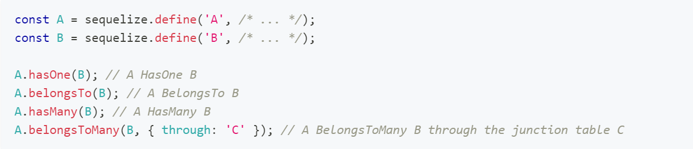
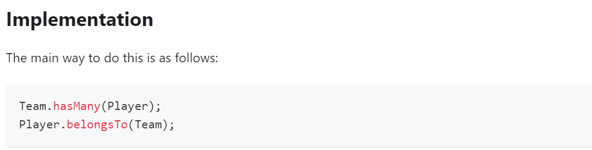
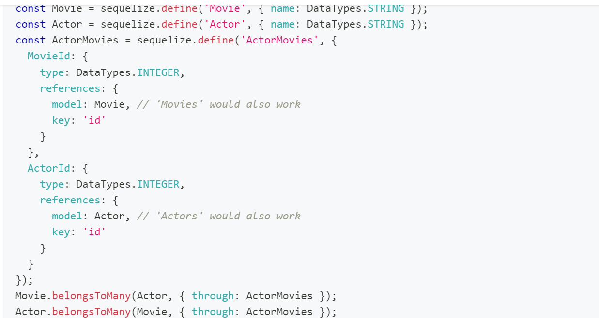

## Sequelize 👋 👩🏻‍💻 

##  Associations:
Sequelize supports the standard associations: One-To-One, One-To-Many and Many-To-Many.

## Four types of associations that provides by Sequelize: 👩🏻‍🏫
* The HasOne association
* The BelongsTo association
* The HasMany association
*The BelongsToMany association 

1. Defining the Sequelize associations:⏭ 
The four association types are defined in a very similar way. 
 
 

2. Creating the standard relationships:⭠👩ğŸ»â€ğŸ« 
* As mentioned, usually the Sequelize associations are defined in pairs. In summary:

- To create a One-To-One relationship, the hasOne and belongsTo associations are used together; 
- To create a One-To-Many relationship, the hasMany and belongsTo associations are used together; 
- To create a Many-To-Many relationship, two belongsToMany calls are used together. 
* Note: there is also a Super Many-To-Many relationship, which uses six associations at once, and will be discussed in the Advanced Many-to-Many relationships guide. 

3. One-To-One relationships:⏭  👩🏻‍🏫  

 

4. One-To-Many relationships:⏭  👩🏻‍🏫  

 
5. Many-To-Many relationships: ⏭  👩🏻‍🏫  

* Philosophy: 
Many-To-Many associations connect one source with multiple targets, while all these targets can in turn be connected to other sources beyond the first. 

6. Basics of queries involving associations:⏭  👩🏻‍🏫  
With the basics of defining associations covered, we can look at queries involving associations. The most common queries on this matter are the read queries (i.e. SELECTs). Later on, other types of queries will be shown. 
 

7. Creating, updating and deleting: ⏭  👩🏻‍🏫  
The above showed the basics on queries for fetching data involving associations. For creating, updating and deleting, you can either:

* Use the standard model queries directly:
 

## Special methods/mixins added to instances: 👀 📝
When an association is defined between two models, the instances of those models gain special methods to interact with their associated counterparts.

* For example, if we have two models, Foo and Bar, and they are associated, their instances will have the following methods/mixins available, depending on the association type:

1. Foo.hasOne(Bar)
2. fooInstance.getBar()
3. fooInstance.setBar()
4. fooInstance.createBar()
 

 

[Back to the main page  ✔️](README.md)