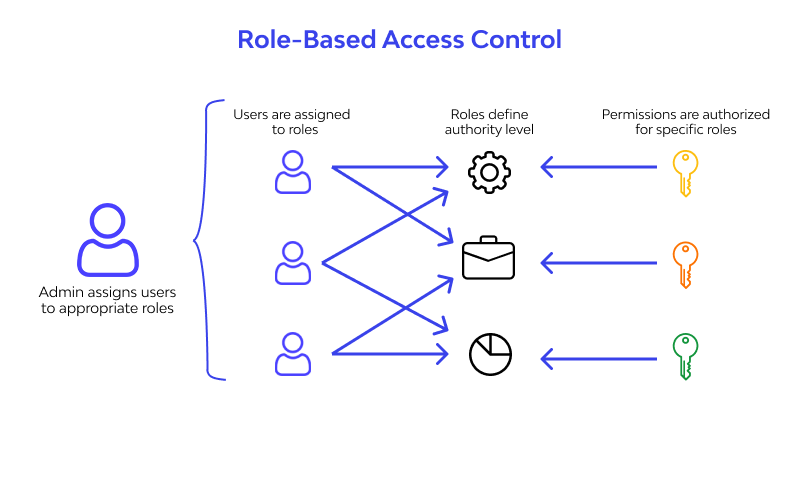

 ## Access Control (ACL) 👋 👩🏻‍💻 

 

 ## 5 steps to simple role-based access control:👀 📝

 RBAC is the idea of assigning system access to users based on their role in an organization. It's important to remember that not every employee needs a starring role.

 

 ## Benefits of RBAC?  👀 📝
 - With the proper implementation of RBAC, the assignment of access rights becomes systematic and repeatable. Further, it is much easier to audit user rights, and to correct any issues identified.

 - RBAC may sound intimidating, but it can in reality be easy to implement, and will make the ongoing management of access rights much easier and more secure.

 ## 👀 📝 RBAC vs. ABAC vs. ACL  👀 📝
 

 ## RBAC implementation 👀 📝
 simplified five-step approach to getting it implemented:
 1. Inventory your systems
 2. Analyze your workforce and create roles
 3. Assign people to roles
 4. Never make one-off changes
 5. Audit
 

 [Back to the main page  ✔️](README.md)