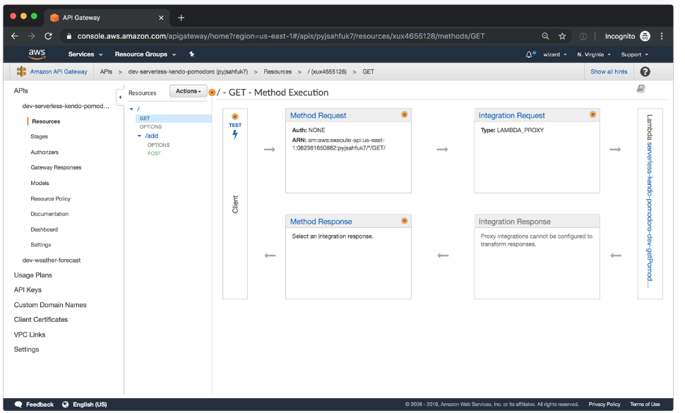
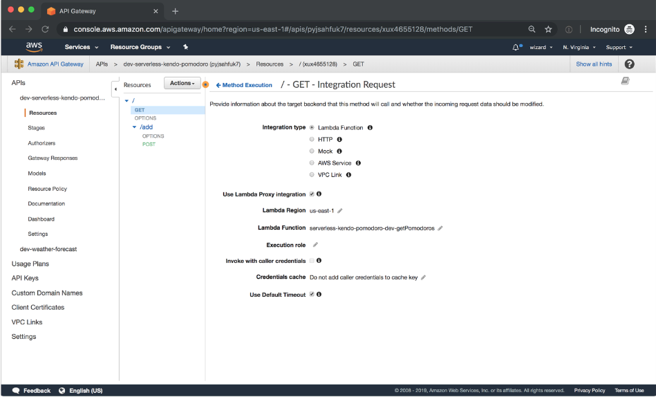
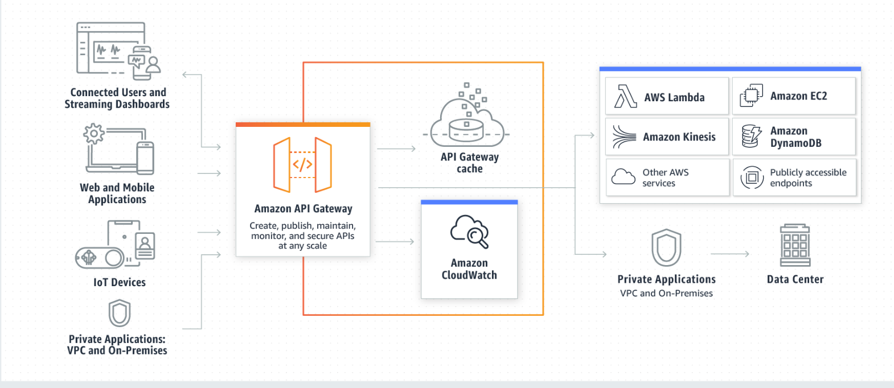
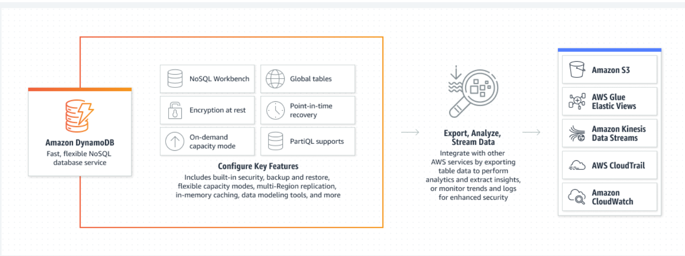

## AWS: API, Dynamo and Lambda 👋 👩🏻‍💻

**AWS API Gateway Overview** 👀 📝

## 1. What is Amazon API Gateway?
Amazon API Gateway is a managed service that allows developers to define the HTTP endpoints of a REST API or a WebSocket API and connect those endpoints with the corresponding backend business logic. It also handles authentication, access control, monitoring, and tracing of API requests.

## 2. Why is Amazon API Gateway an important part of the Serverless ecosystem?
Within the Serverless ecosystem, API Gateway is the piece that ties together Serverless functions and API definitions. Being able to trigger the execution of a Serverless function directly in response to an HTTP request is the key reason why API Gateway is so valuable in Serverless setups: it enables a truly serverless architecture for web applications. When using API Gateway together with other AWS services, it’s possible to build a fully functional customer-facing web application without maintaining a single server yourself.

This brings the advantages of the serverless model—scalability, low maintenance, and low cost due to low overhead—to mainstream web applications.

## 3. How does API Gateway integrate with other AWS services?
Many AWS services support integration with Amazon API Gateway, including:

1. AWS Lambda: run Lambda functions to generate HTTP API responses.
2. AWS SNS: publish SNS notifications when an HTTP API endpoint is accessed.
3. Amazon Cognito: provide authentication and authorization for your HTTP APIs.

 **API Gateway supports direct integrations that can be configured in the API Gateway user interface (or via the 5. API Gateway’s own API) for the following actions:**

1. Invoking an AWS Lambda function.
2. Invoking another HTTP endpoint, with or without VPC Link.
3. Making an HTTP call against the API of any AWS service that provides an HTTP API.
4. Returning a mock response generated within API Gateway without calling out to other services.

## How API Gateway Works 👀 📝

## What is DynamoDB? 👀 📝
DynamoDB is a hosted NoSQL database offered by Amazon Web Services (AWS). It offers:

1. reliable performance even as it scales;
2. a managed experience, so you won't be SSH-ing into servers to upgrade the crypto libraries;
3. a small, simple API allowing for simple key-value access as well as more advanced query patterns.

**DynamoDB is a particularly good fit for the following use cases:**

- Applications with large amounts of data and strict latency requirements. As your amount of data scales, JOINs and advanced SQL operations can slow down your queries. With DynamoDB, your queries have predictable latency up to any size, including over 100 TBs!

- Serverless applications using AWS Lambda. AWS Lambda provides auto-scaling, stateless, ephemeral compute in response to event triggers. DynamoDB is accessible via an HTTP API and performs authentication & authorization via IAM roles, making it a perfect fit for building Serverless applications.

- Data sets with simple, known access patterns. If you're generating recommendations and serving them to users, DynamoDB's simple key-value access patterns make it a fast, reliable choice.

## Amazon DynamoDB 👀 📝
**How it works**

Amazon DynamoDB is a fully managed, serverless, key-value NoSQL database designed to run high-performance applications at any scale. DynamoDB offers built-in security, continuous backups, automated multi-Region replication, in-memory caching, and data export tools.

>> Reference: >>
1. [AWS API Gateway Overview](https://www.serverless.com/guides/amazon-api-gateway)
2. [AWS API Gateway](https://aws.amazon.com/api-gateway/)
3. [AWS DynamoDB Guide](https://www.dynamodbguide.com/what-is-dynamo-db/)
4. [AWS DynamoDB](https://aws.amazon.com/dynamodb/)

[Back to the main page  ✔️](README.md)

