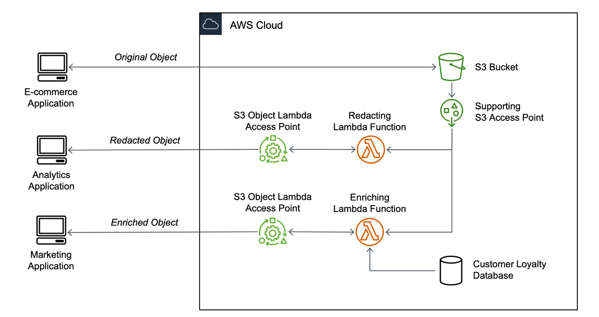
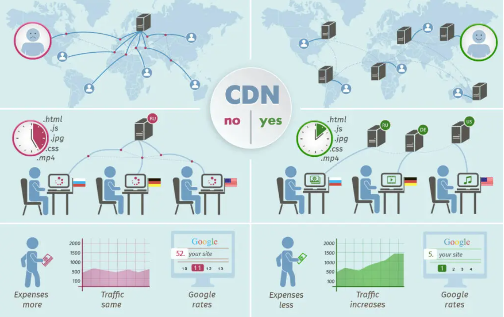

## AWS: S3 and Lambda 👋 👩🏻‍💻

## AWS: S3
----------------------------------
**What is Amazon S3?** 👀 📝

1- Amazon S3 or Amazon Simple Storage Service is a service offered by Amazon Web Services (AWS) that provides object storage through a web service interface.

2- Amazon S3 uses the same scalable storage infrastructure that Amazon.com uses to run its e-commerce network.

3- Amazon S3 can store any type of object, which allows uses like storage for Internet applications, backups, disaster recovery, data archives, data lakes for analytics, and hybrid cloud storage.

## some use cases for Amazon S3 >>>👀 📝

- Understanding Storage Patterns

- Managing Unpredictable Workloads

- Complying with Regulations

-----------------------------
## some benefits of using Amazon S3 >>>👀 📝

- Reliable Security

- All-time Availability

- Very Low cost

- Ease of Migration

- The Simplicity of Management

-----------------------------------
## AWS Lambda Basics >>>👀 📝

**What is AWS Lambda?**

Lambda is a compute service that lets you run code without provisioning or managing servers. Lambda runs your code on a high-availability compute infrastructure and performs all of the administration of the compute resources, including server and operating system maintenance, capacity provisioning and automatic scaling, code monitoring and logging. With Lambda, you can run code for virtually any type of application or backend service. All you need to do is supply your code in one of the languages that Lambda supports.

----------------------
## some use cases for AWS Lambdas >>>👀 📝

1. Serverless Website Application

2. Scheduled, Cron, Periodical Jobs

3. Stream Large Data With Kinesis Data Stream and Lambda

4. Say Hello to Amazon Alexa

5. Real-Time Notifications

6. Middleware

7. Workflows

----------------------
## CDN >>>👀 📝

**What is a CDN?**

A content delivery network (CDN) refers to a geographically distributed group of servers which work together to provide fast delivery of Internet content.

A CDN allows for the quick transfer of assets needed for loading Internet content including HTML pages, javascript files, stylesheets, images, and videos. The popularity of CDN services continues to grow, and today the majority of web traffic is served through CDNs, including traffic from major sites like Facebook, Netflix, and Amazon.

A properly configured CDN may also help protect websites against some common malicious attacks, such as Distributed Denial of Service (DDOS) attacks.

---------------------------

<<References:<<
 1. [AWS S3](https://aws.amazon.com/s3/)

 2. [AWS Lambda Basics](https://www.serverless.com/aws-lambda)

3. [CDN](https://cyberhoot.com/cybrary/content-delivery-network-cdn/)

-----------------------------

[Back to the main page  ✔️](README.md)