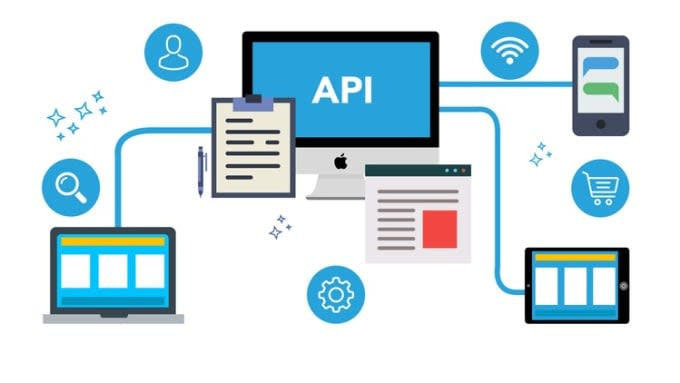

## API Integration 👋 👩🏻‍💻

## Review, Research, and Discussion

* How do bearer tokens work? 👀 📝
The Bearer Token is created for you by the Authentication server. When a user authenticates your application (client) the authentication server then goes and generates for you a Token.

* Describe express middleware? 👀 📝
Express middleware are functions that execute during the lifecycle of a request to the Express server.

Each middleware has access to the HTTP request and response for each route (or path) it's attached to. 
In fact, Express itself is compromised wholly of middleware functions.

* What is a JWT? 👀 📝
JSON Web Token (JWT) is an open standard (RFC 7519) that defines a compact and self-contained way for securely 
transmitting information between parties as a JSON object.
This information can be verified and trusted because it is digitally signed.

- JWTs can be signed using a secret (with the HMAC algorithm) or a public/private key pair using RSA or ECDSA. 
- Although JWTs can be encrypted to also provide secrecy between parties, we will focus on signed tokens.
- Signed tokens can verify the integrity of the claims contained within it, while encrypted tokens hide those claims from other parties.
- When tokens are signed using public/private key pairs, 
the signature also certifies that only the party holding the private key is the one that signed it.

## Document the following Vocabulary Terms 👀 📝

* role based access control: 

- (RBAC) is a method of restricting network access based on the roles of individual 
users within an enterprise.
- RBAC lets employees have access rights only to the information they need to do their 
jobs and prevents them from accessing information that doesn't pertain to them

* http cookies: 
Cookies are text files with small pieces of data — like a username and password — 
that are used to identify your computer as you use a computer network.

- Specific cookies known as HTTP cookies are used to identify specific users and improve your web browsing experience.

## Review API Server Build 👀 📝

* Dynamic API Server

- An Express/Node.js based server designed to be a “model agnostic” REST API server, which can perform (CRUD) operations on any data model.

## Support all REST/HTTP methods:

* GET: Retrieve record(s) from a data source (All, One (by id), Some (by filtering)).

* POST: Create a new record in a data source.

* PUT: Update a single full record in a data source.

* PATCH: Update part of a single record in a data source.

* DELETE: Delete a record in a data source.

- Obey a standard routing structure: i.e. http://amazingapi.com/api/v1/products/12345

* /api/v# where # is the version number of our API.
* /model where ‘model’ is the name of the data model to operate on.
* /id where ‘id’ is the id number of a specific entity in the data model.

- Allow for Query String parameters for filtering: i.e. http://amazingapi.com/api/v1/products?category=electronics

This would GET every entry in our products data model where the category is ‘electronics’.

## Obey a standard output format: 👀 📝

* Results will be returned in JSON format.
* Results will be served with the correct HTTP header - application/json.
* The GET Route, when not retrieving by ID, must return a full header, with count ,pages, and a results array.
* All other routes must return a single object, representing the state of the entity following the operation.

## Review Auth Server Build 👀 📝

## Authentication Server / Module

An Express/Node.js based server using a custom “authentication” module that is designed to handle user registration and sign in using Basic, Bearer, or OAuth along with a custom “authorization” module that will grant/deny users access to the server based on their role or permissions level.

* The system to be built will have the following core features:
1. Users can create an account, associated with a “role”.
2. User Roles will be pre-defined and will each have a list of allowed capabilities:
- admin can (read, create, update, delete).
- editor can (read, create, update).
- writer can (read, create).
- user can (read).

3. Users can then login with a valid username and password.
4. Alternatively, users can login using an OAuth provider such as Google or GitHub.
- In this case, users should be automatically assigned the role of user.

5. Once logged in, Users can then access any route on the server, so long as they are permitted by the capabilities that match their role.
- For example, a route that deletes records should only work if your user role is admin.

 

## References:

1. [Review API Server Build](https://codefellows.github.io/code-401-javascript-guide/curriculum/apps-and-libraries/api-server/)

2. [Review Auth Server Build]()

[Back to the main page  ✔️](README.md)
