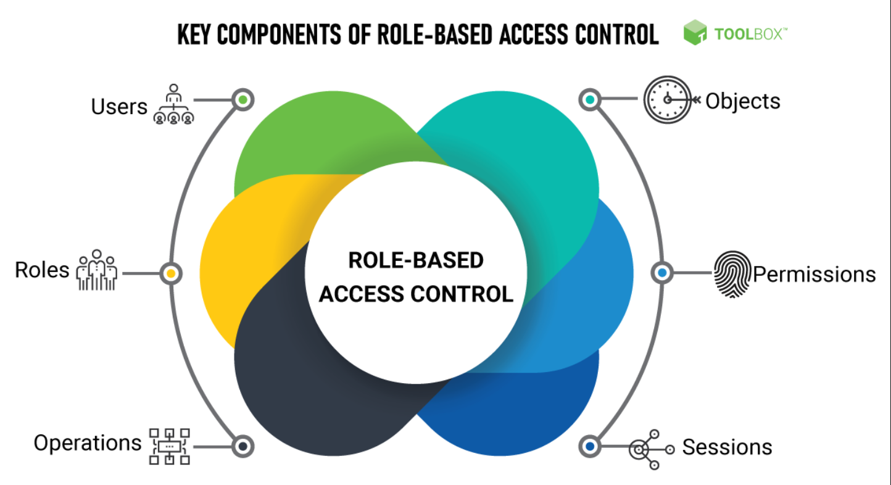

## API Integration 👋 👩🏻‍💻

## Review, Research, and Discussion

* How do bearer tokens work? 👀 📝
The Bearer Token is created for you by the Authentication server. When a user authenticates your application (client) the authentication server then goes and generates for you a Token.

* Describe express middleware? 👀 📝
Express middleware are functions that execute during the lifecycle of a request to the Express server.

Each middleware has access to the HTTP request and response for each route (or path) it's attached to. 
In fact, Express itself is compromised wholly of middleware functions.

* What is a JWT? 👀 📝
JSON Web Token (JWT) is an open standard (RFC 7519) that defines a compact and self-contained way for securely 
transmitting information between parties as a JSON object.
This information can be verified and trusted because it is digitally signed.

- JWTs can be signed using a secret (with the HMAC algorithm) or a public/private key pair using RSA or ECDSA. 
- Although JWTs can be encrypted to also provide secrecy between parties, we will focus on signed tokens.
- Signed tokens can verify the integrity of the claims contained within it, while encrypted tokens hide those claims from other parties.
- When tokens are signed using public/private key pairs, 
the signature also certifies that only the party holding the private key is the one that signed it.

## Document the following Vocabulary Terms 👀 📝

* role based access control: 

- (RBAC) is a method of restricting network access based on the roles of individual 
users within an enterprise.
- RBAC lets employees have access rights only to the information they need to do their 
jobs and prevents them from accessing information that doesn't pertain to them

* http cookies: 
Cookies are text files with small pieces of data — like a username and password — 
that are used to identify your computer as you use a computer network.

- Specific cookies known as HTTP cookies are used to identify specific users and improve your web browsing experience.

 

[Back to the main page  ✔️](README.md)
