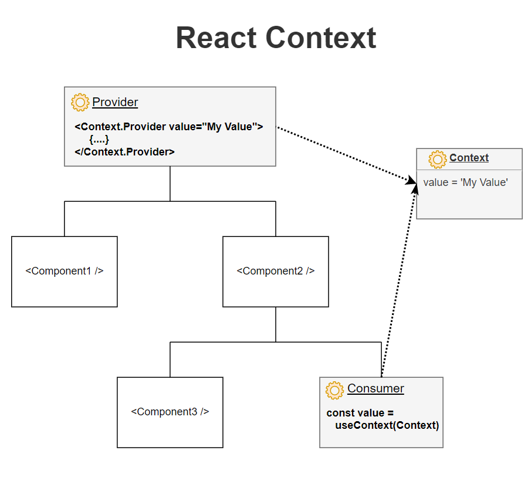
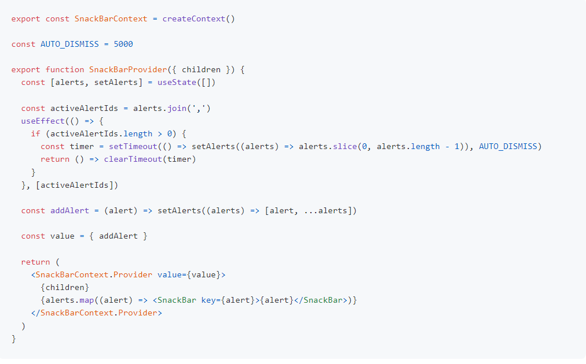

## Context API - Behaviors 👋 👩🏻‍💻

## Hooks and Context example>> 👀 📝
-  With regard to the React Context API, what does a “provider” do?
>>React’s provider pattern is a powerful concept. React uses provider pattern in Context API to share data across the tree descendant nodes. You may not find this useful when you are using plain react. However, this pattern comes handy when you are designing a complex app since it solves multiple problems.  

- Context provide a way to pass data through the component tree without 
having to pass down manually at every level

## Higher Level API & Behaviour

>>There’s a lot more happening now. Our provider now exposes a new function called addAlert. This function uses the local state mutator useState to properly append a new alert without destroying existing ones. You could do more fancy things here: de-dup alerts, assign unique IDs to alerts so that we can also expose a removeAlert function that makes use of those IDs, and so on. But we’re going to keep it simple.

[Awesome React Context links](https://github.com/diegohaz/awesome-react-context)

## Videos >>
1. [Use the new React Context API by Andrew Van Slaars (paid)](https://egghead.io/lessons/react-creating-providers-and-consumers-with-the-react-context-api)

2. [Heres how React's New Context API Works by Wes Bos](https://www.youtube.com/watch?v=XLJN4JfniH4)

3. [React's All New Context API by Harry Wolff](https://www.youtube.com/watch?v=9Ilq6G-VMyQ)

4. [https://www.youtube.com/watch?v=WhWqy-vxKS8](https://www.youtube.com/watch?v=WhWqy-vxKS8)

## Examples
1. [compare-react-state-management - React createContext vs Apollo vs MobX vs Redux in a simple todo app](https://github.com/robertgonzales/compare-react-state-management)

2. [ThemeContext - CodeSandbox example using React v16.3.0-alpha.0](https://codesandbox.io/s/n4r0qq898j)

3. [Themer - React Context demo on CodeSandbox](https://codesandbox.io/s/n5pk7613xm)

 
 

[Back to the main page  ✔️](README.md)