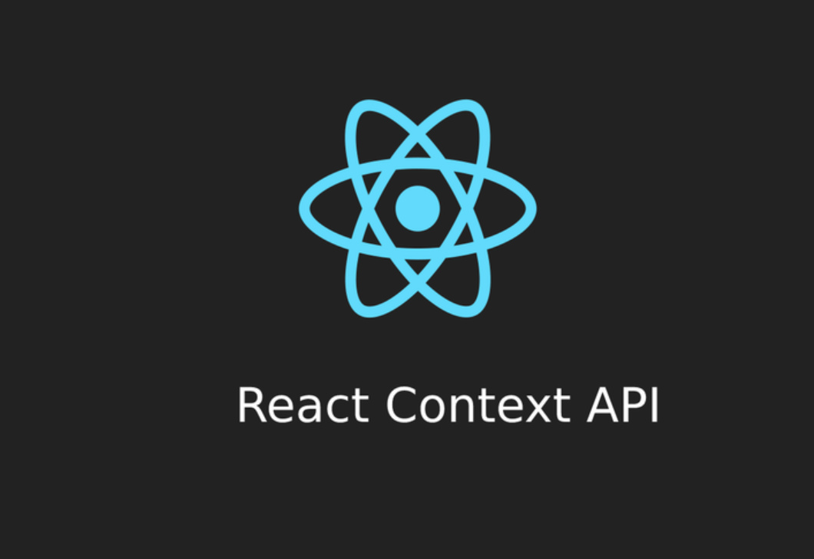

## Context API 👋 👩🏻‍💻

## ***Context provides a way to pass data through the component tree without having to pass props down manually at every level.
In a typical React application, data is passed top-down (parent to child) via props, but such usage can be cumbersome for certain types of props (e.g. locale preference, UI theme) that are required by many components within an application. Context provides a way to share values like these between components without having to explicitly pass a prop through every level of the tree.***

## When to Use Context?👀 📝
>>Context is designed to share data that can be considered “global” for a tree of React components, such as the current authenticated user, theme, or preferred language. For example, in the code below we manually thread through a “theme” prop in order to style the Button component:

>>Using context, we can avoid passing props through intermediate elements:

## Before You Use Context 👀 📝
**If you only want to avoid passing some props through many levels, component composition is often a simpler solution than context.**

>>For example, consider a Page component that passes a user and avatarSize prop several levels down so that deeply nested Link and Avatar components can read it:

>>One way to solve this issue without context is to pass down the Avatar component itself so that the intermediate components don’t need to know about the user or avatarSize props:

>>You’re not limited to a single child for a component. You may pass multiple children, or even have multiple separate “slots” for children.

## API

- **React.createContext**
***const MyContext = React.createContext(defaultValue);***

>>Creates a Context object. When React renders a component that subscribes to this Context object it will read the current context value from the closest matching Provider above it in the tree.

- **Context.Provider**
***<MyContext.Provider value={/* some value */}>***

>>Every Context object comes with a Provider React component that allows consuming components to subscribe to context changes.

- **Class.contextType**

>>The contextType property on a class can be assigned a Context object created by React.createContext(). Using this property lets you consume the nearest current value of that Context type using this.context. You can reference this in any of the lifecycle methods including the render function.

- **Context.Consumer**

>>A React component that subscribes to context changes. Using this component lets you subscribe to a context within a function component.

- **Context.displayName**
Context object accepts a displayName string property. React DevTools uses this string to determine what to display for the context.

>>For example, the following component will appear as MyDisplayName in the DevTools:

## [Awesome React Context links](https://github.com/diegohaz/awesome-react-context)

## References:
[Context API](https://reactjs.org/docs/context.html)

 
 

[Back to the main page  ✔️](README.md)
