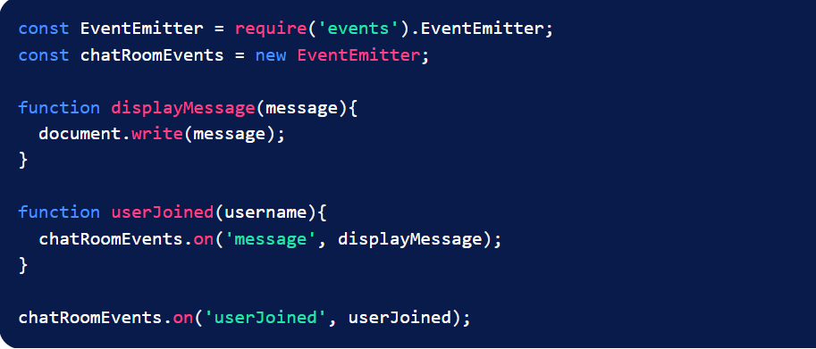

## Event-Driven Programming in Node.js 👋 👩🏻‍💻 

## Overview:  👀 📝
* Event-Driven Programming is a logical pattern that we can choose to confine our programming within to avoid issues of complexity and collision.

1. An Event Handler is a callback function that will be called when an event is triggered.

2. A Main Loop listens for event triggers and calls the associated event handler for that event.

## EventEmitter: 👀 📝
* Node.js natively provides us with a useful module called EventEmitter that allows us to get started incorporating Event-Driven Programming in our project right away.

We access the EventEmitter class through the events module.

 

* Now we can get started with Event-Driven Programming in Node.
 

* The next step would be to make sure that our chat room triggers a userJoined event whenever someone logs in so that our event handler is called.
 

## Removing Listeners: 👀 📝
 

* So we can rewrite the code like this:
 

* Now if we want to remove the displayMessage function from the message event’s list of handlers:

**chatRoomEvents.removeListener('message', displayMessage);**

## Object Oriented Programming + Event-Driven Programming: 👀 📝
 

* In this example, our gator had to access the methods inside of Food in order to eat. This is a lot of work for our lazy gator so we’re going to make things easier for him.
 

[Back to the main page  ✔️](README.md)