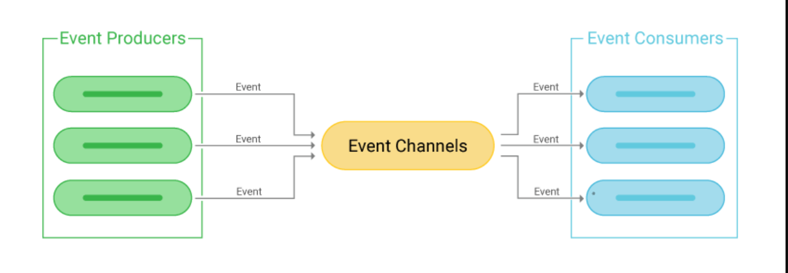
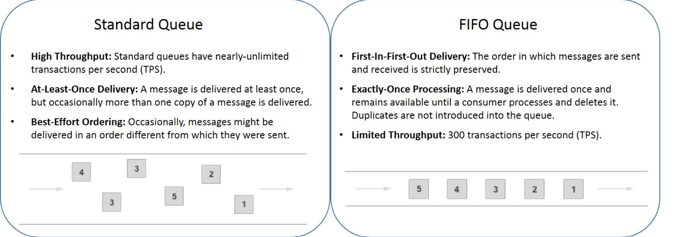
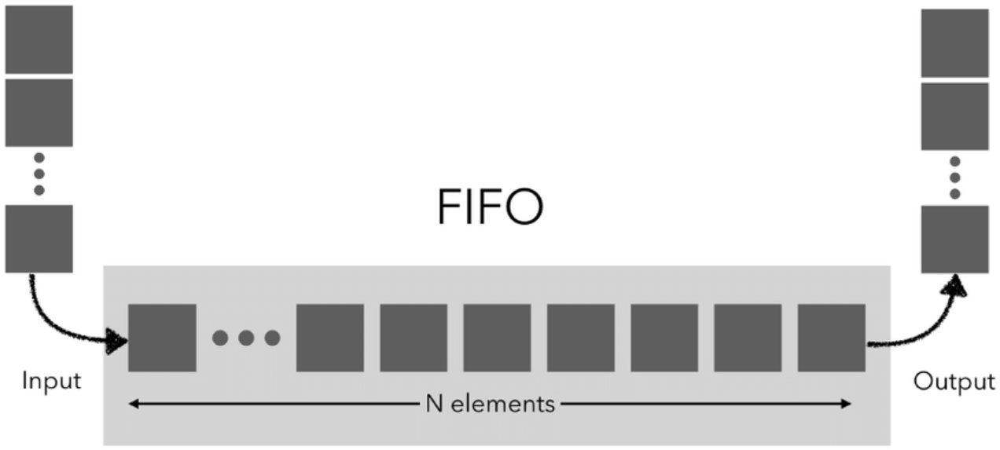
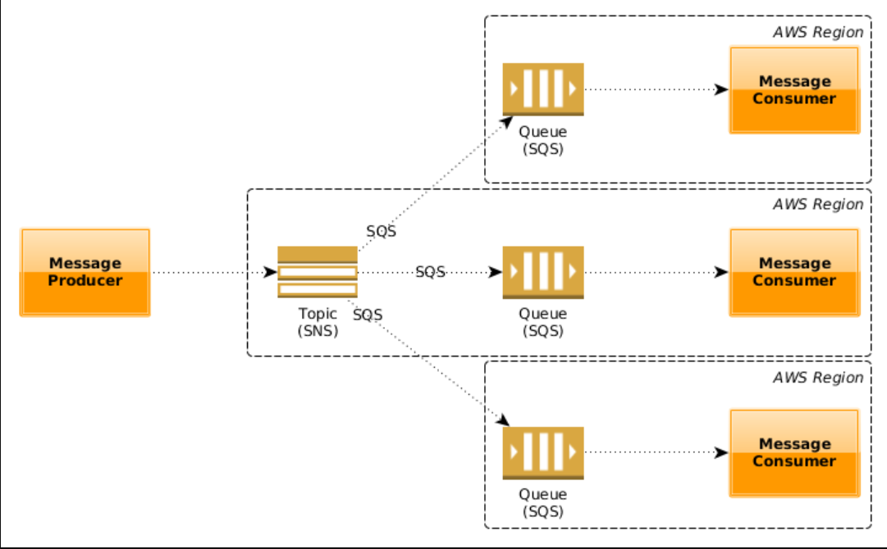

## Event Driven Architecture 👋 👩🏻‍💻
what is Event Driven Architecture?  

**Event-driven architecture (EDA) is a software architecture paradigm promoting the production, detection, consumption of, and reaction to events. … A car dealer’s system architecture may treat this state change as an event whose occurrence can be made known to other applications within the architecture.**

## Review, Research, and Discussion 👀 📝
What is the difference between a FIFO and a standard queue?

* **How can the server be assured a message was properly received?** 👀 📠 

by recieving a response from client side, else will throw an error. What classic design pattern is best represented by event driven programming?

The observer pattern is a software design pattern in which an object, named the subject, maintains a list of its dependents, called observers, and notifies them automatically of any state changes, usually by calling one of their methods.

* **How do you test an event driven system?**  👀 📠 

by testing, mocking and spy.

* **Document the following Vocabulary Terms
FIFO Queue :**  

 *  A FIFO queue is a queue that operates on the first-in, first-out principle, hence the name. This is also referred to as the first-come, first-served principle.

 

* Pub/Sub :
 Publish/subscribe messaging, or pub/sub messaging, is a form of asynchronous service-to-service communication used in serverless and microservices architectures. In a pub/sub model, any message published to a topic is immediately received by all of the subscribers to the topic. Pub/sub messaging can be used to enable event-driven architectures, or to decouple applications in order to increase performance, reliability and scalability.

## Preparation Materials : 👀 📝
**AWS SNS and SQS**
1. SNS>>>  

simple notification services. publisher/subscriber system. publish a message about some topic, then will be delivered to many subscribers with different types.

2. SQS>>>  

simple queue service. queueing service for message processing. the system must poll the queue to discover a new event. processing in the queue will be for single consumer. it is important to use SNS in your application to make the notification process goes in parallel not in sequence. then will aviod the partial failing errors. that’s means only the failed process will be restarted not the whole cycle.
 

[Back to the main page  ✔️](README.md)