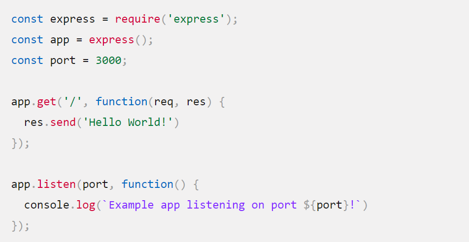

## Express 👋 👩🏻‍💻 

1>> Introduction to NodeJS. 👀  
2>> Introduction to Express. 👀 
3>> What is NPM? 📫 
4>> What is TDD? 📫 
5>> CI/CD.👀   

 #  👀Introduction to NodeJS 👀 📝 
  is an open-source, cross-platform runtime environment that allows developers to create all kinds of server-side tools and applications in JavaScript. 

  *** From a web server development perspective Node has a number of benefits:

  a. Great performance
  b. Code is written in "plain old JavaScript", which means that less time is spent dealing with "context shift".
  c. The node package manager (NPM) provides access to hundreds of thousands of reusable packages.
  d. Node.js is portable
  e. It has a very active third party ecosystem and developer community, with lots of people who are willing to help.

  # 👀Introduction to Express 👀 📝 
  is the most popular Node web framework, and is the underlying library for a number of other popular Node web frameworks.

  * Express provides mechanisms to:
  a.Write handlers for requests with different HTTP verbs at different URL paths (routes). 
   
  b.Integrate with "view" rendering engines in order to generate responses by inserting data into templates. 
   
  c.Set common web application settings like the port to use for connecting, and the location of templates that are used for rendering the response.  
  d.Add additional request processing "middleware" at any point within the request handling pipeline.
   

 # Helloworld Express Example ✍🏾 
 

 ## 👩🏻‍🏫 What is NPM? 🔍 🔍
 npm is the world's largest software registry. Open source developers from every continent use npm to share and borrow packages, and many organizations use npm to manage private development as well.

 **npm consists of three distinct components: 🖍
   i. the website
  ii. the Command Line Interface (CLI)
  iii.the registry

 
     
## 👩🏻‍🏫 What is TDD? 🔍 🔍
 🖇 “Test-driven development” 🖇
refers to a style of programming.

 **8three activities are tightly interwoven:  
 a.coding 
 b. testing (in the form of writing unit tests)  
c. design (in the form of refactoring). 

## 📝 ✏️ 📝
** TDD can be succinctly described by the following set of rules:
1.Write a “single” unit test describing an aspect of the program. 
2.Run the test, which should fail because the program lacks that feature. 
3.Write “just enough” code, the simplest possible, to make the test pass. 
4.“Refactor” the code until it conforms to the simplicity criteria. 
5.epeat, “accumulating” unit tests over time. 
 

## 🔎 CI/CD  🔍
⏩ CI "Continuous Integration":
is a workflow strategythat helps ensure everyone's changes will integrate with the current version of the project. This lets you catch bugs, reduce merge conflicts, and have confidence your software is working. 

⏩ CD "Continuous Delivery": 
is the practice of developing software in such a way that you could release it at any time. When coupled with CI, continuous delivery lets you develop features with modular code in more manageable increments.

[Back](README.md)

