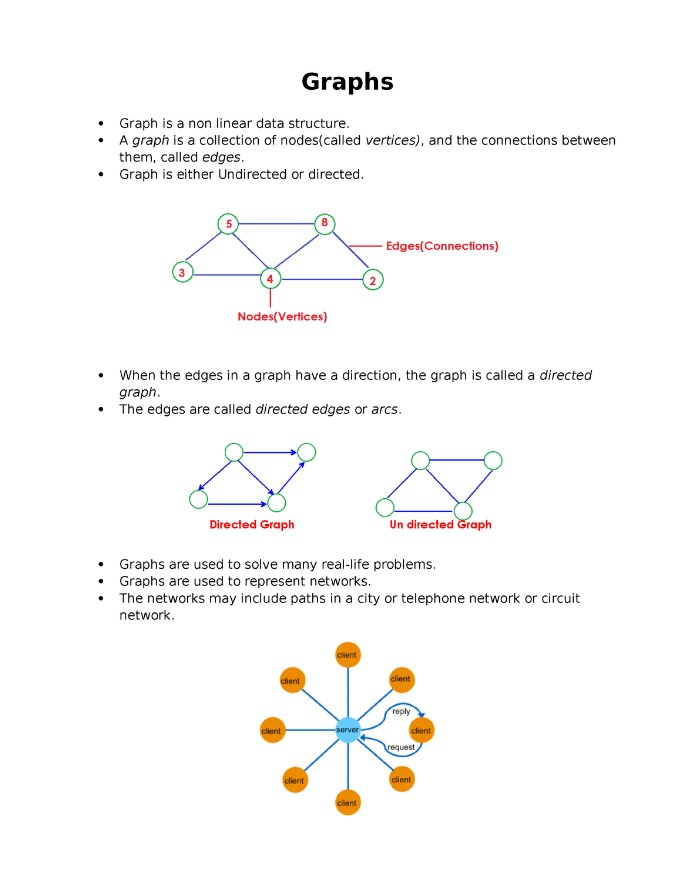
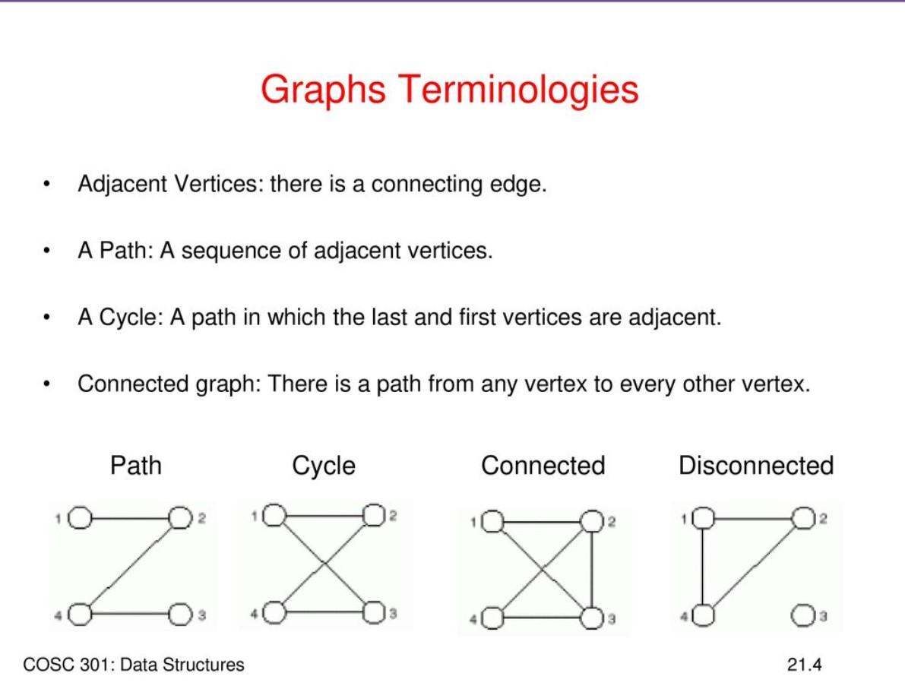
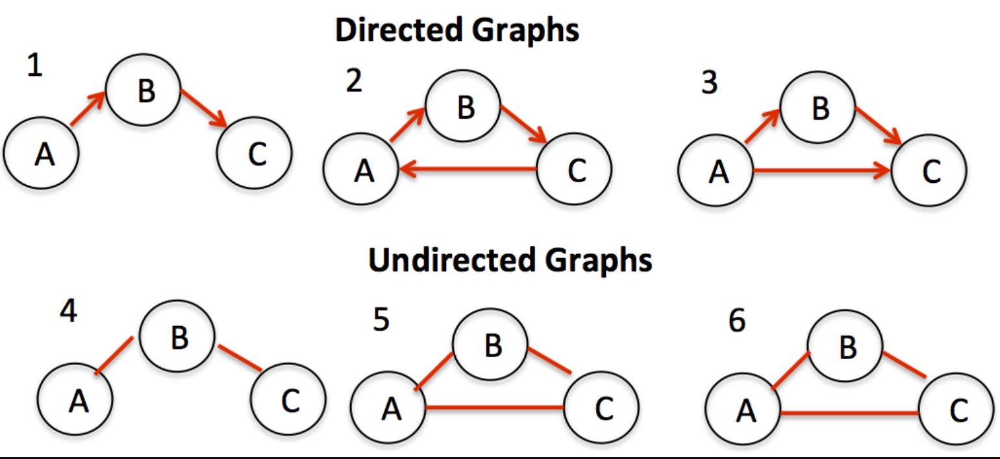
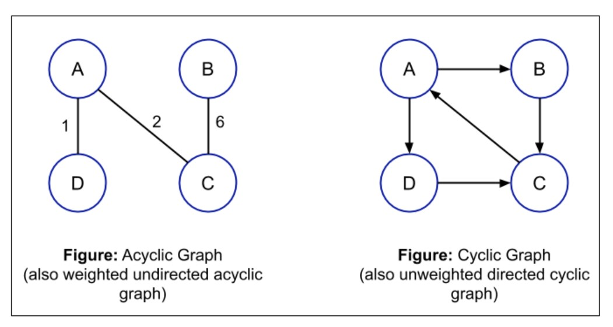
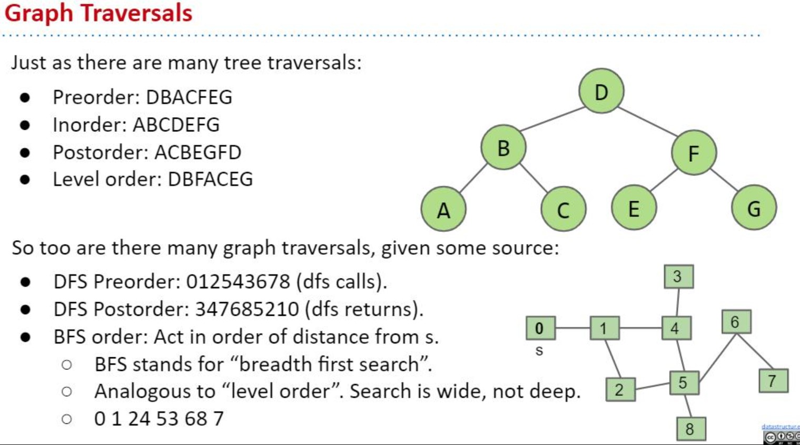
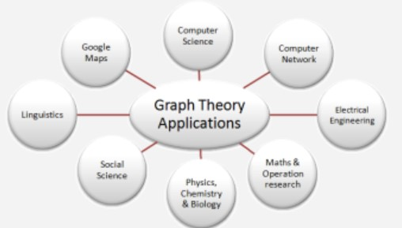

## Graphs 👋 👩🏻‍💻

## Terminology 👀 📝

- Vertex - A vertex, also called a “node”, is a data object that can have zero or more adjacent vertices.
- Edge - An edge is a connection between two nodes.
- Neighbor - The neighbors of a node are its adjacent nodes, i.e., are connected via an edge.
- Degree - The degree of a vertex is the number of edges connected to that vertex.

## Directed vs Undirected 👀 📝

* Undirected Graphs:
>>An Undirected Graph is a graph where each edge is undirected or bi-directional. This means that the undirected graph does not move in any direction.

* Directed Graphs (Digraph):
>>A Directed Graph also called a Digraph is a graph where every edge is directed. unlike an undirected graph, a Digraph has direction. Each node is directed at another node with a specific requirement of what node should be referenced next.

## Complete vs Connected vs Disconnected 👀 📝
* Complete Graphs:
>>A complete graph is when all nodes are connected to all other nodes.

* Connected:
>>A connected graph is graph that has all of vertices/nodes have at least one edge.

* Disconnected:
>>A disconnected graph is a graph where some vertices may not have edges.

## Acyclic vs Cyclic 👀 📝

* Acyclic Graph: -An acyclic graph is a directed graph without cycles. A cycle is when a node can be traversed through and potentially end up back at itself.

* Cyclic Graphs:
A Cyclic graph is a graph that has cycles. A cycle is defined as a path of a positive length that starts and ends at the same vertex.

## Graph Representation 👀 📝
* Adjacency Matrix:
>>is represented through a 2-dimensional array. If there are n vertices, then we are looking at an n x n Boolean matrix, each Row and column represents each vertex of the data structure. The elements of both the column and the row must add up to 1 if there is an edge that connects the two, or zero if there isn’t a connection.

* Adjacency List:
>>An adjacency list is the most common way to represent graphs, it is a collection of linked lists or array that lists all of the other vertices that are connected.

## Graphs Traversals: 👀 📝

- BFS => Breadth-First traversal.
- DFS => Deppth-First traversal.

## Real World Uses of Graphs 👀 📝

- GPS and Mapping
- Driving Directions
- Social Networks
- Airline Traffic
- Netflix uses graphs for suggestions of products

 

[Back to the main page  ✔️](README.md)