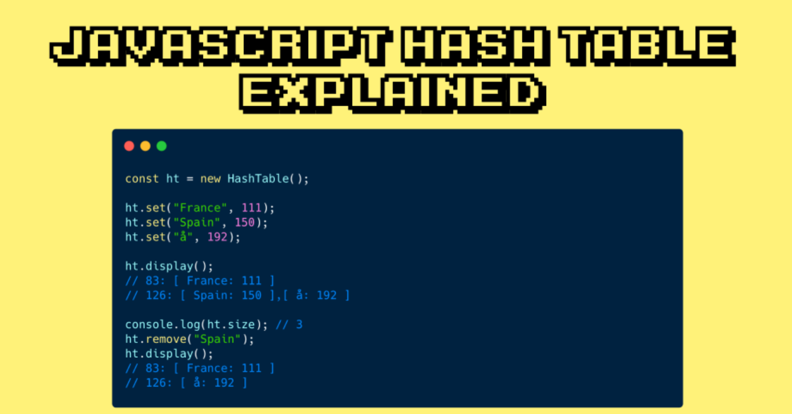
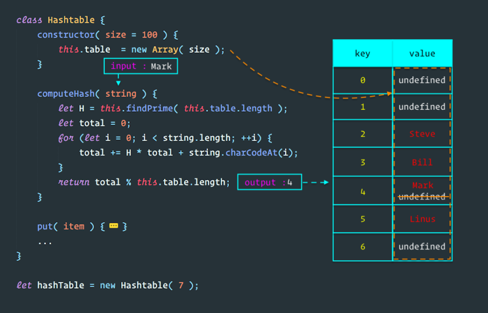
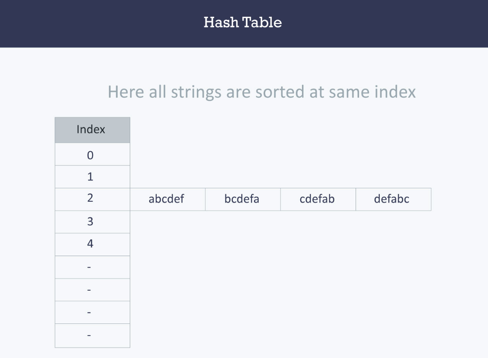
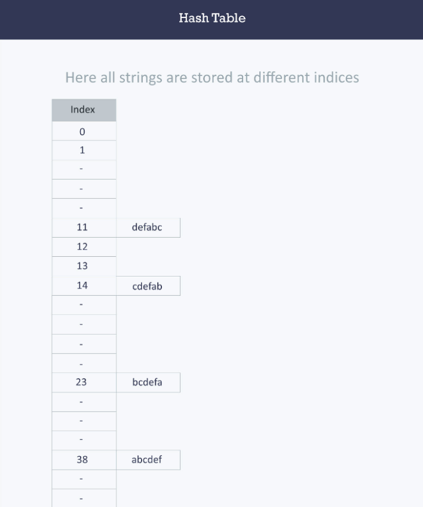
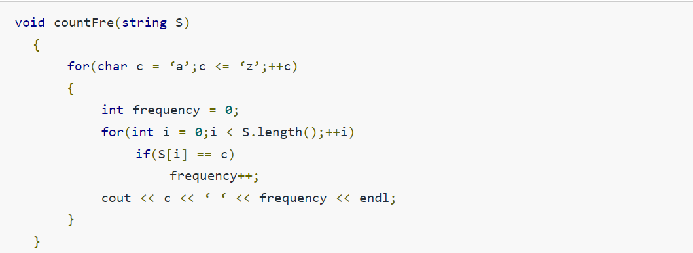
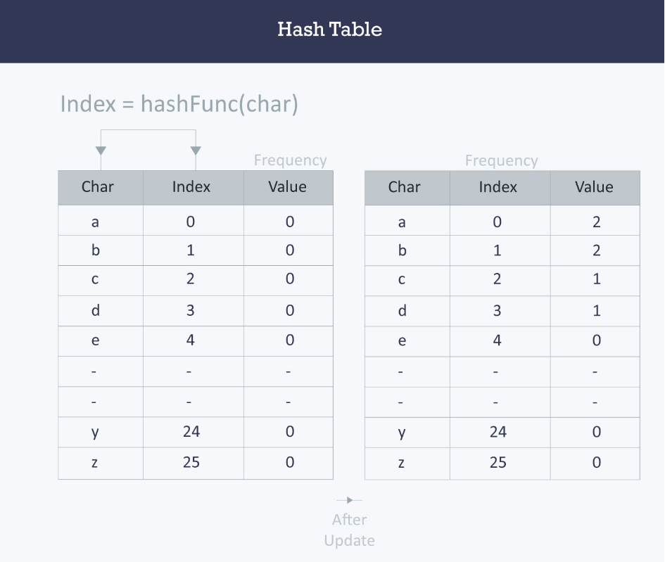

## Hash Tables👋 👩🏻‍💻

## - What is a Hashtable? 👀 📝
Terminology:

- Hash - A hash is the result of some algorithm taking an incoming string and converting it into a value that could be used for either security or some other purpose. In the case of a hashtable, it is used to determine the index of the array.
- Buckets - A bucket is what is contained in each index of the array of the hashtable. Each index is a bucket. An index could potentially contain multiple key/value pairs if a collision occurs.
- Collisions - A collision is what happens when more than one key gets hashed to the same location of the hashtable.

## Why do we use them? 👀 📝
1. Hold unique values
2. Dictionary
3. Library

## What Are they 👀 📝
Hashtables are a data structure that utilize key value pairs. This means every Node or Bucket has both a key, and a value.

>> Let’s say we have data of Seattle neighborhood names and their corresponding zip codes.

>>["Greenwood:98103", "Downtown:98101", "Alki Beach:98116", "Bainbridge Island:98110", ...]

## Basics of Hash Tables 👀 📝

>>String                                Hash function                               Index
abcdef       (971 + 982 + 993 + 1004 + 1015 + 1026)%2069       38
bcdefa       (981 + 992 + 1003 + 1014 + 1025 + 976)%2069       23
cdefab       (991 + 1002 + 1013 + 1024 + 975 + 986)%2069       14
defabc       (1001 + 1012 + 1023 + 974 + 985 + 996)%2069       11

* **Hash table
Hash table
A hash table is a data structure that is used to store keys/value pairs. It uses a hash function to compute an index into an array in which an element will be inserted or searched. By using a good hash function, hashing can work well. Under reasonable assumptions, the average time required to search for an element in a hash table is O(1).
Let us consider string S. You are required to count the frequency of all the characters in this string.**
>>string S = “ababcd”

* **The simplest way to do this is to iterate over all the possible characters and count their frequency one by one. The time complexity of this approach is O(26*N) where N is the size of the string and there are 26 possible characters.**

* Output>>>

a 2 
b 2 
c 1 
d 1 
e 0 
f 0 
… 
z 0 

## Resources >>
1. Read [Intro to Hash Tables](https://codefellows.github.io/common_curriculum/data_structures_and_algorithms/Code_401/class-30/resources/Hashtables.html)
2. Watch [what is a hash table?](https://www.youtube.com/watch?v=MfhjkfocRR0)
3. Read [basics of hash tables](https://www.hackerearth.com/practice/data-structures/hash-tables/basics-of-hash-tables/tutorial/)
4. Skim [hash table wiki](https://en.wikipedia.org/wiki/Hash_table)

 
 

[Back to the main page  ✔️](README.md)