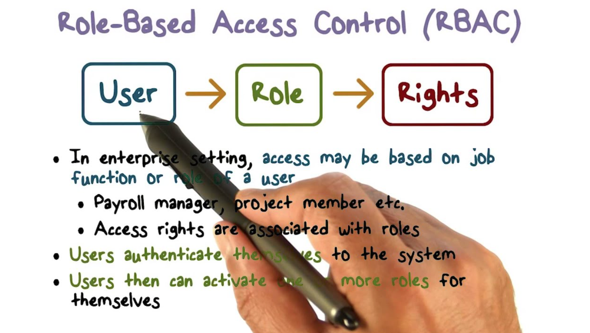
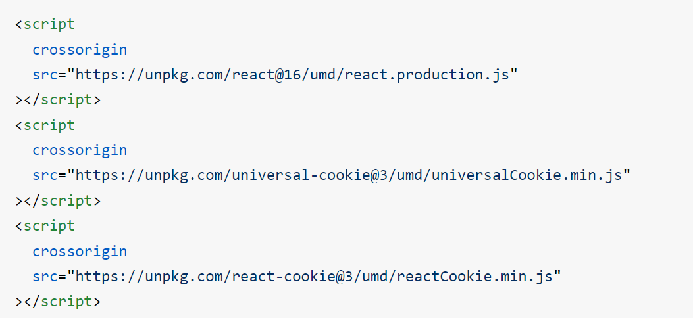
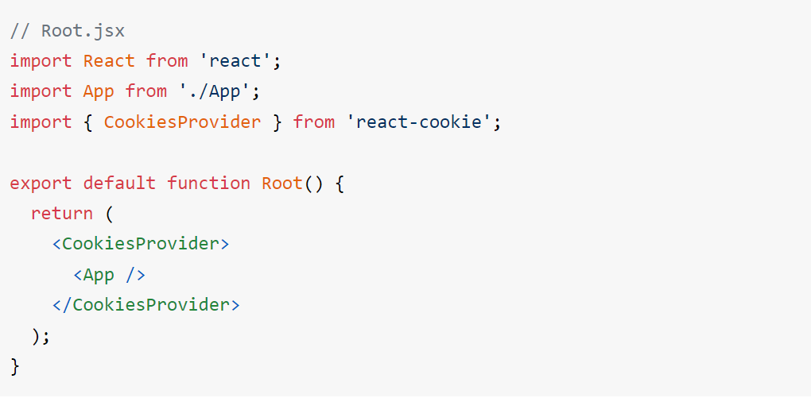
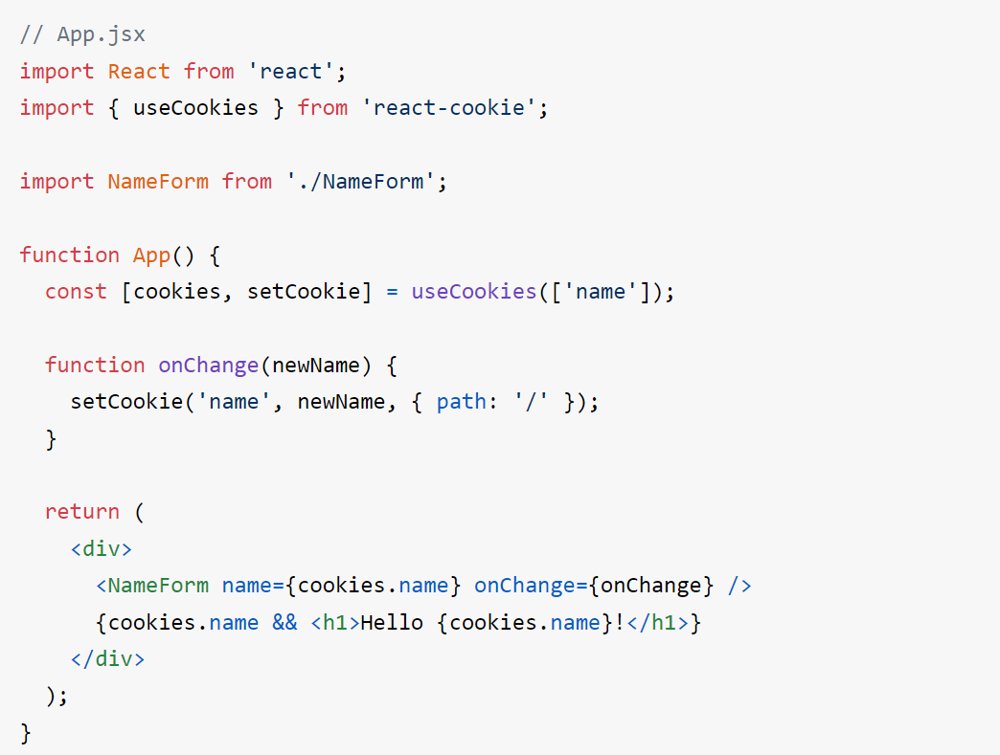
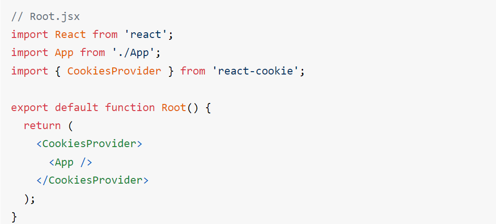
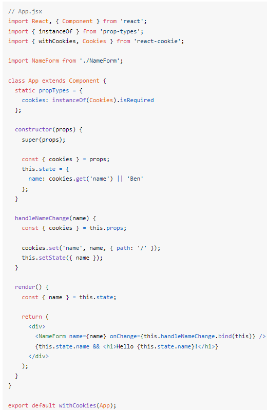

## Reading: Login  and Auth 👋 👩🏻‍💻

## ***1. What is Role Based Access Control (RBAC)?***

## DEFINITION OF ROLE-BASED ACCESS CONTROL (RBAC) 👀 📝
Role-based access control (RBAC) restricts network access based on a person's role within an organization and has become one of the main methods for advanced access control. The roles in RBAC refer to the levels of access that employees have to the network.

## **2. Share some an example of RBAC including all possible CRUD operations and correlating roles.**

## EXAMPLES OF ROLE-BASED ACCESS CONTROL 👀 📝
>>Through RBAC, you can control what end-users can do at both broad and granular levels. You can designate whether the user is an administrator, a specialist user, or an end-user, and align roles and access permissions with your employees’ positions in the organization. Permissions are allocated only with enough access as needed for employees to do their jobs.

 

**Some of the designations in an RBAC tool can include:**

Management role scope – it limits what objects the role group is allowed to manage.
Management role group – you can add and remove members.
Management role – these are the types of tasks that can be performed by a specific role group.
Management role assignment – this links a role to a role group.

## ***3. What are the Benefits of RBAC?***
## BENEFITS OF RBAC : 👀 📝
1. Reducing administrative work and IT support.
2. Maximizing operational efficiency.
3. Improving compliance.

## react-cookie 👀 📝
- Integrations>>
1. universal-cookie - Universal cookies for JavaScript
2. universal-cookie-express - Hook cookies get/set on Express for server-rendering

## Minimum requirement
- react-cookie @ v3.0+
>> React.js >= 16.3.0 (new context API + forward ref)
- react-cookie @ v0.0-v2.2
>>React.js >= 15

## Getting started
>> npm install react-cookie

## CookiesProvider 
- Set the user cookies

On the server, the cookies props must be set using req.universalCookies or new Cookie(cookieHeader)

>>useCookies([dependencies])

- Access and modify cookies using React hooks.

>>const [cookies, setCookie, removeCookie] = useCookies(['cookie-name']);

## Cookies
>>get(name, [options])
Get a cookie value

>>name (string): cookie name
options (object):
doNotParse (boolean): do not convert the cookie into an object no matter what
getAll([options])
Get all cookies

>> options (object):
doNotParse (boolean): do not convert the cookie into an object no matter what
set(name, value, [options])
Set a cookie value

## Simple Example with React hooks

## Simple Example with Higher-Order Component

## Refrences >> 
1. [react-cookie library](https://www.npmjs.com/package/react-cookie)

2. [react-cookies component](https://www.npmjs.com/package/react-cookies)

3. [What is Role Based Access Control (RBAC)?](https://digitalguardian.com/blog/what-role-based-access-control-rbac-examples-benefits-and-more)

[Back to the main page  ✔️](README.md)