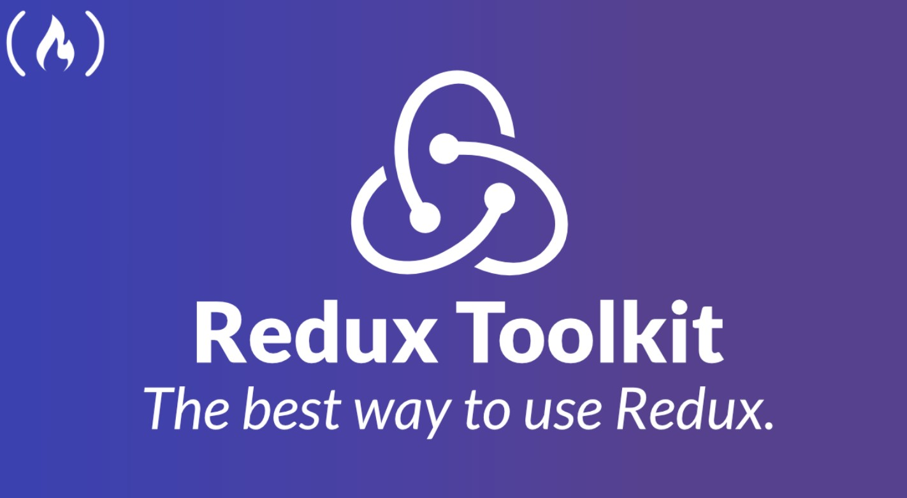

## Redux - Additional Topics 👋 👩🏻‍💻

## Review, Research, and Discussion 👀 📝🔎
* What’s the best practice for “pre-loading” data into the store (on application start) in a Redux application?

>>to fire off the asynchronous action in the lifecycle method (probably componentWillMount ) of a Higher Order Component that wraps your app.

>>Create an empty object or array to the initial state, dispatch the action in useEffect hook.

*When using a thunk/async action that dispatches the actual action, which do you export from your reducer?
>>the thunk action, because it is the one that will be used in the components

## Document the following Vocabulary Terms
* Middleware:
>>is software which lies between an operating system and the applications running on it.

* Thunk:
>>is a middleware that allows you to call the action creators that return a function(thunk) which takes the store's dispatch method as the argument and which is afterwards used to dispatch the synchronous action after the API or side effects has been finished.

## Preparation Materials
***Redux Toolkit (RTK)***

 - RTK Query is an optional addon included in the Redux Toolkit package, and its functionality is built on top of the other APIs in Redux Toolkit. - RTK Query is a powerful data fetching and caching tool. It is designed to simplify common cases for loading data in a web application, eliminating the need to hand-write data fetching & caching logic yourself.

 [the "Learn Modern Redux" show notes page ](https://www.learnwithjason.dev/let-s-learn-modern-redux)

## Installation

|>>Using Create React App>>>
# Redux + Plain JS template
npx create-react-app my-app --template redux

# Redux + TypeScript template
npx create-react-app my-app --template redux-typescript
Redux Toolkit is available as a package on NPM for use with a module bundler or in a Node application:

**npm install @reduxjs/toolkit**

## Redux Toolkit includes these APIs:
1. configureStore(): wraps createStore to provide simplified configuration options and good defaults. It can automatically combine your slice reducers, adds whatever Redux middleware you supply, includes redux-thunk by default, and enables use of the Redux DevTools Extension.

2. createReducer(): that lets you supply a lookup table of action types to case reducer functions, rather than writing switch statements. In addition, it automatically uses the immer library to let you write simpler immutable updates with normal mutative code, like state.todos[3].completed = true.

3. createAction(): generates an action creator function for the given action type string. The function itself has toString() defined, so that it can be used in place of the type constant.

4. createSlice(): accepts an object of reducer functions, a slice name, and an initial state value, and automatically generates a slice reducer with corresponding action creators and action types.

5. createAsyncThunk: accepts an action type string and a function that returns a promise, and generates a thunk that dispatches pending/fulfilled/rejected action types based on that promise

6. createEntityAdapter: generates a set of reusable reducers and selectors to manage normalized data in the store

7. The createSelector utility from the Reselect library, re-exported for ease of use.

 

 ## Refrences >>
 1. [Redux Toolkit (RTK)](https://redux-toolkit.js.org/)

2. [MobX](https://mobx.js.org/getting-started.html)

3. [HookState](https://hookstate.js.org/)

 

[Back to the main page  ✔️](README.md)