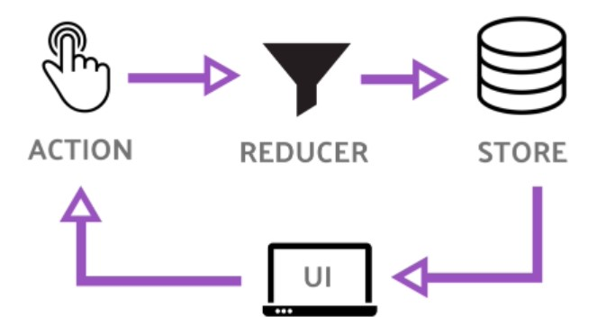
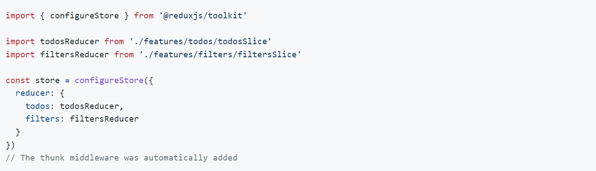

## Redux - Asynchronous Actions 👋 👩🏻‍💻

## Review, Research, and Discussion  👀 📝
* How granular should your reducers be?
- As granular as possible.

* Pro or Con – multiple reducers can “fire” when a commonly named action is dispatched?
- It depends on the implementation, it can cause errors if written poorly, or can result in clean firm code if done with caution.

* Name a strategy for preventing the above..
- Putting all the actions in one file, so their names and types can be compared quickly.

## Document the following Vocabulary Terms 👀 📝
* store:
>>is a state container which holds the application's state. Redux can have only a single store in your application. Whenever a store is created in Redux, you need to specify the reducer. Let us see how we can create a store using the createStore method from Redux.

* combined reducers:
>>a helper function turns an object whose values are different reducing functions into a single reducing function you can pass to createStore . The resulting reducer calls every child reducer, and gathers their results into a single state object.

## Preparation Materials 👀 📝
* async actions >>

* Redux Middleware and Side Effects
1. A "side effect" is any change to state or behavior that can be seen outside of returning a value from a function. Some common kinds of side effects are things like:
2. Logging a value to the console
3. Saving a file
4. Setting an async timer
5. Making an AJAX HTTP request
6. Modifying some state that exists outside of a function, or mutating arguments to a function
7. Generating random numbers or unique random IDs (such as Math.random() or Date.now())

* Writing an Async Function Middleware
>>Both of the middleware in that last section were very specific and only do one thing. It would be nice if we had a way to write any async logic ahead of time, separate from the middleware itself, and still have access to dispatch and getState so that we can interact with the store.

## redux thunk

* By default, Redux’s actions are dispatched synchronously, which is a problem for any non-trivial app that needs to communicate with an external API or perform side effects. Redux also allows for middleware that sits between an action being dispatched and the action reaching the reducers.

* The most common use case for Redux Thunk is for communicating asynchronously with an external API to retrieve or save data. Redux Thunk makes it easy to dispatch actions that follow the lifecycle of a request to an external API.

## Using the Redux Thunk Middleware
>>As it turns out, Redux already has an official version of that "async function middleware", called the Redux "Thunk" middleware. The thunk middleware allows us to write functions that get dispatch and getState as arguments. The thunk functions can have any async logic we want inside, and that logic can dispatch actions and read the store state as needed.

## Instalation
>>npm install redux-thunk

## Redux Toolkit
>>If you're using our official Redux Toolkit package as recommended, there's nothing to install - RTK's configureStore API already adds the thunk middleware by default:

## Manual Setup
>>If you're using the basic Redux createStore API and need to set this up manually, first add the redux-thunk package:

1. npm install redux-thunk

2. yarn add redux-thunk

## References
1. [async actions](https://redux.js.org/tutorials/fundamentals/part-6-async-logic)
2. [thunk middleware](https://github.com/reduxjs/redux-thunk)
3. [redux thunk](https://www.digitalocean.com/community/tutorials/redux/redux-thunk-)

[Back to the main page  ✔️](README.md)