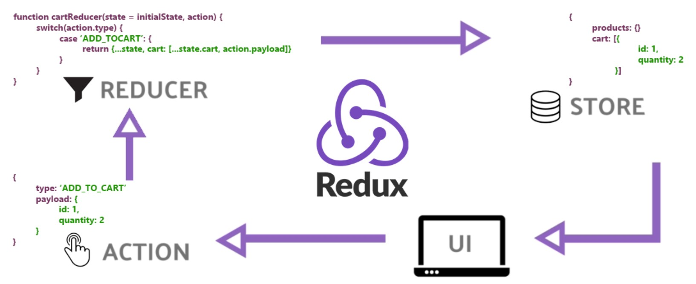

## Redux 👋 👩🏻‍💻

## Application State with Redux
- Review, Research, and Discussion

* What are the advantages of storing tokens in “Cookies” vs “Local Storage”?
>>Although cookies still have some vulnerabilities, it's preferable compared to localStorage whenever possible. ... Both localStorage and cookies are vulnerable to XSS attacks but it's harder for the attacker to do the attack when you're using httpOnly cookies

* Explain 3rd party cookies.
>>Third-party cookies are cookies that are set by a website other than the one you are currently on. For example, you can have a "Like" button on your website which will store a cookie on a visitor's computer, that cookie can later be accessed by Facebook to identify visitors and see which websites they visited.

* How do pixel tags work?
>>A tracking pixel (also called 1x1 pixel or pixel tag) is a graphic with dimensions of 1x1 pixels that is loaded when a user visits a webpage or opens an email. The tracking pixel URL is the memory location on the server. When the user visits a website, the image with the tag is loaded from this server.

## Document the following Vocabulary Terms
* cookies:
>>A cookie is information saved by your web browser. When you visit a website, the site may place a cookie on your web browser so it can recognize your device in the future. If you return to that site later on, it can read that cookie to remember you from your last visit and keep track of you over time.

* authorization:
>>s the function of specifying access rights/privileges to resources, which is related to general information security and computer security, and to access control in particular. More formally, "to authorize" is to define an access policy.

* access control:
>>is a fundamental component of data security that dictates who's allowed to access and use company information and resources. Through authentication and authorization, access control policies make sure users are who they say they are and that they have appropriate access to company data.

* conditional rendering:
>>is a term to describe the ability to render different user interface (UI) markup if a condition is true or false. In React, it allows us to render different elements or components based on a condition. This concept is applied often in the following scenarios: Rendering external data from an API.

## Preparation Materials
* Redux>>>

1. Redux is a predictable state container designed to help you write JavaScript apps that behave consistently across client, server, and native environments and are easy to test. While it's mostly used as a state management tool with React, you can use it with any other JavaScript framework or library

2. Redux provides a solid, stable, and mature solution to managing state in your React application. Through a handful of small, useful patterns, Redux can transform your application from a total mess of confusing and scattered state, into a delightfully organized, easy to understand modern JavaScript powerhouse.

 

[Back to the main page  ✔️](README.md)