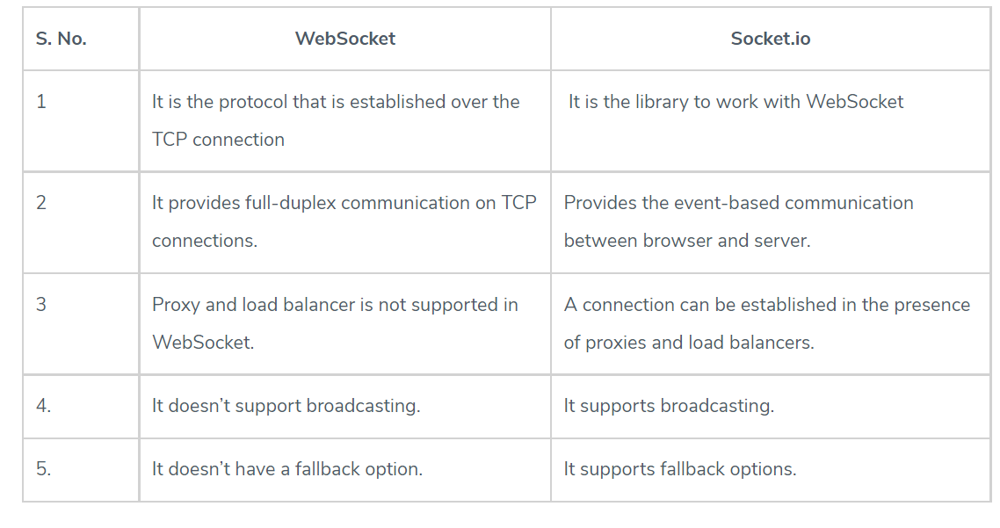

## Socket.io 👋 👩🏻‍💻

## What is a Web Socket? 👀 📝
WebSocket is a computer communications protocol, providing full-duplex communication channels over a single TCP connection.
- The WebSocket protocol was standardized by the IETF as RFC 6455 in 2011.
- The current API specification allowing web applications to use this protocol is known as WebSockets.

## How it works: 👀 📝

## The WebSocket Protocol has two parts: 
a handshake to establish the upgraded connection, then the actual data transfer. 
- First, a client requests a WebSocket connection by using the Upgrade: WebSocket and Connection: Upgrade headers, along with a few protocol-specific headers to establish the version being used and set up a handshake.

- The server, if it supports the protocol, replies with the same Upgrade: WebSocket and Connection: Upgrade headers and completes the handshake. Once the handshake is completed successfully, data transfer begins.

- The Upgrade header field is an HTTP header field introduced in HTTP/1.1. In the exchange, the client begins by making a cleartext request, which is later upgraded to a newer HTTP protocol version or switched to a different protocol.

- A connection upgrade must be requested by the client; if the server wants to enforce an upgrade it may send a 426 Upgrade Required response. The client can then send a new request with the appropriate upgrade headers while keeping the connection open

**JavaScript client example:** 

js // Creates new WebSocket object with a wss URI as the parameter const socket = new WebSocket(‘wss://game.example.com/ws/updates’);
// Fired when a connection with a WebSocket is opened socket.onopen = function () { setInterval(function() { if (socket.bufferedAmount == 0) socket.send(getUpdateData()); }, 50); };

// Fired when data is received through a WebSocket socket.onmessage = function(event) { handleUpdateData(event.data); };

// Fired when a connection with a WebSocket is closed socket.onclose = function(event) { onSocketClose(event); };

// Fired when a connection with a WebSocket has been closed because of an error socket.onerror = function(event) { onSocketError(event); };

## Key Differences between WebSocket and socket.io: 👀 📝

Both WebSocket vs Socket.io are popular choices in the market; WebSocket vs Socket.io:

It provides the Connection over TCP, while Socket.io is a library to abstract the WebSocket connections.
WebSocket doesn’t have fallback options, while Socket.io supports fallback.
WebSocket is the technology, while Socket.io is a library for WebSockets.

[Back to the main page  ✔️](README.md)