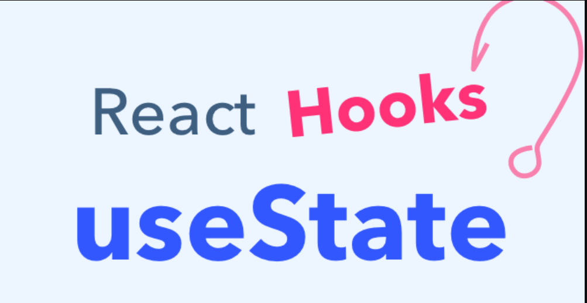
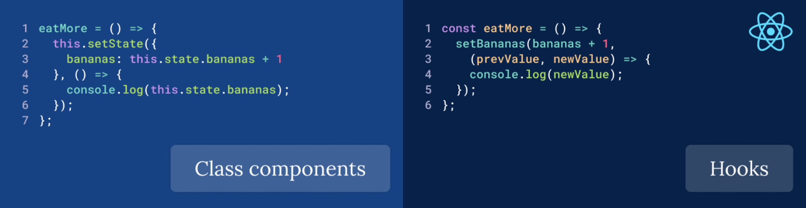
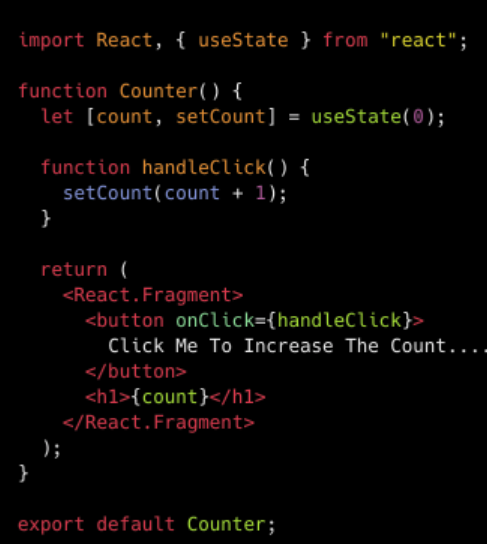
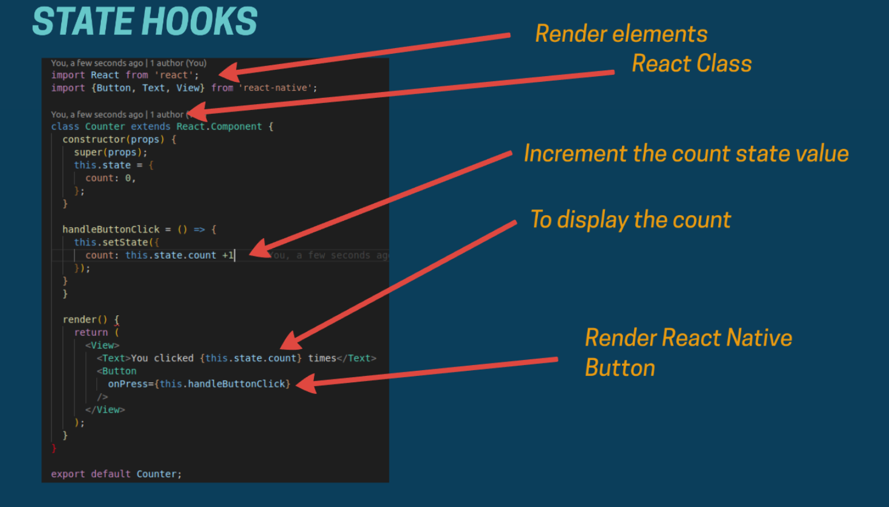

## Using The State Hook 👋 👩🏻‍💻

## Introducing Hooks 👀 📝

***Hooks are a new addition in React 16.8. They let you use state and other React features without writing a class.***

import React, { useState } from 'react';

function Example() {
  // Declare a new state variable, which we'll call "count"
  const [count, setCount] = useState(0);

  return (
    

      
You clicked {count} times

      <button onClick={() => setCount(count + 1)}>
        Click me
      </button>
    

  );
}

**What was the motivation for introducing Hooks?** 👀 📝

Hooks solve a wide variety of seemingly unconnected problems in React that we’ve encountered over five years of writing and maintaining tens of thousands of components. 

***Equivalent Class Example*** 👀 📝

If you used classes in React before, this code should look familiar:

***class Example extends React.Component {
  constructor(props) {
    super(props);
    this.state = {
      count: 0
    };
  }***

  ***render() {
    return (
      

        
You clicked {this.state.count} times

        <button onClick={() => this.setState({ count: this.state.count + 1 })}>
          Click me
        </button>
      

    );
  }
}***

>> The state starts as { count: 0 }, and we increment state.count when the user clicks a button by calling this.setState(). We’ll use snippets from this class throughout the page.

## Hooks and Function Components 👀 📝
As a reminder, function components in React look like this:

***const Example = (props) => {
  // You can use Hooks here!
  return 
;
}***

>> or this:

***function Example(props) {
  // You can use Hooks here!
  return 
;
}***

>> You might have previously known these as “stateless components”. We’re now introducing the ability to use React state from these, so we prefer the name “function components”.

>> Hooks don’t work inside classes. But you can use them instead of writing classes.

## What’s a Hook? 👀 📝
A Hook is a special function that lets you “hook into” React features. For example, useState is a Hook that lets you add React state to function components. We’ll learn other Hooks later.

>> Our new example starts by importing the useState Hook from React:

***import React, { useState } from 'react';

function Example() {
  // ...
}***

## When would I use a Hook? 👀 📝
If you write a function component and realize you need to add some state to it, previously you had to convert it to a class. Now you can use a Hook inside the existing function component. We’re going to do that right now!

>>>Note:
There are some special rules about where you can and can’t use Hooks within a component. We’ll learn them in Rules of Hooks.

**Declaring a State Variable In a class, we initialize the count state to 0 by setting this.state to { count: 0 } in the constructor:**

***class Example extends React.Component {
  constructor(props) {
    super(props);
    this.state = {
      count: 0
    };
  }***

 *  **In a function component, we have no this, so we can’t assign or read this.state. Instead, we call the useState Hook directly inside our component:**

***import React, { useState } from 'react';***

***import React, { useState } from 'react';
function Example() {
  // Declare a new state variable, which we'll call "count"
  const [count, setCount] = useState(0);***

 

>>We declare a state variable called count, and set it to 0. React will remember its current value between re-renders, and provide the most recent one to our function. If we want to update the current count, we can call setCount.

## how to use useState Hooks 👀 📝

## Refrences >>
1. Introducing Hooks >>
[Introducing Hooks](https://canvas.instructure.com/courses/4839234/discussion_topics/14886079)

2. Hooks api >>
[hooks api](https://reactjs.org/docs/hooks-overview.html)

3. The state hook >>
[the state hook](https://reactjs.org/docs/hooks-state.html)

 

[Back to the main page  ✔️](README.md)