## Trees 👋 👩🏻‍💻

* Binary Trees>>>>
* Binary Search Trees>>>>
* K-ary Trees>>>>

## Common Terminology 👀 📝
- Node - A Tree node is a component which may contain its own values, and references to other nodes
- Root - The root is the node at the beginning of the tree
- K - A number that specifies the maximum number of children any node may have in a k-ary tree. In a binary tree, k = 2.
- Left - A reference to one child node, in a binary tree
- Right - A reference to the other child node, in a binary tree
- Edge - The edge in a tree is the link between a parent and child node
- Leaf - A leaf is a node that does not have any children
- Height - The height of a tree is the number of edges from the root to the furthest lea

## Sample Tree 👀 📝
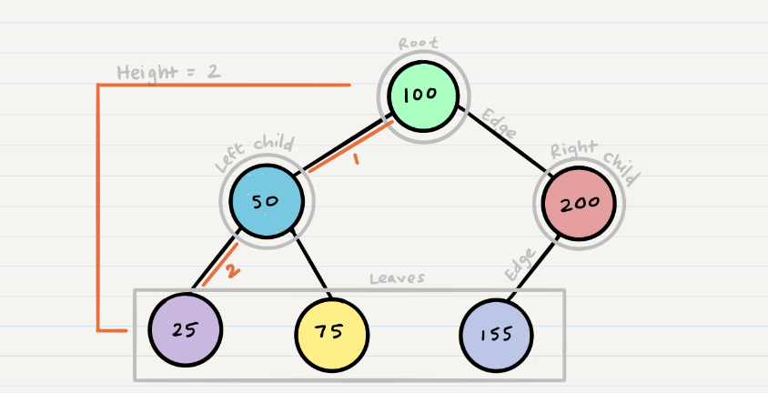

## Traversals
An important aspect of trees is how to traverse them. Traversing a tree allows us to search for a node, print out the contents of a tree, and much more! There are two categories of traversals when it comes to trees:

- Depth First >>>>>>
- Breadth First>>>>>

**Depth First>>>>** 
Depth first traversal is where we prioritize going through the depth (height) of the tree first. There are multiple ways to carry out depth first traversal, and each method changes the order in which we search/print the root. Here are three methods for depth first traversal:

- Pre-order: root >> left >> right
- In-order: left >> root >> right
- Post-order: left >> right >> root

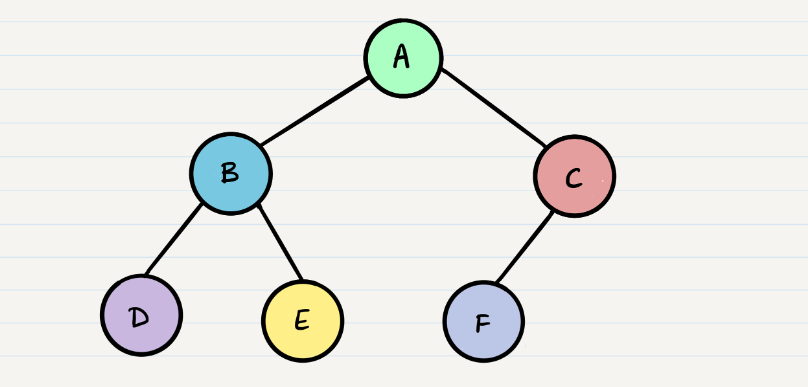

* Given the sample tree above, our traversals would result in different paths:

- Pre-order: A, B, D, E, C, F
- In-order: D, B, E, A, F, C
- Post-order: D, E, B, F, C, A

**It’s important to note a few things that are about to happen:**

The program will look for both a root.left and a root.right. Both will return null, so it will end the execution of that method call
D will pop off of the call stack and the root will be reassigned back to B
This is the heart of recursion: when we complete a function call, we pop it off the stack and are able to continue execution through the previous function call

- The code block will now pick up where it left off when B was the root. Since it already looked for root.left, it will now look for root.right

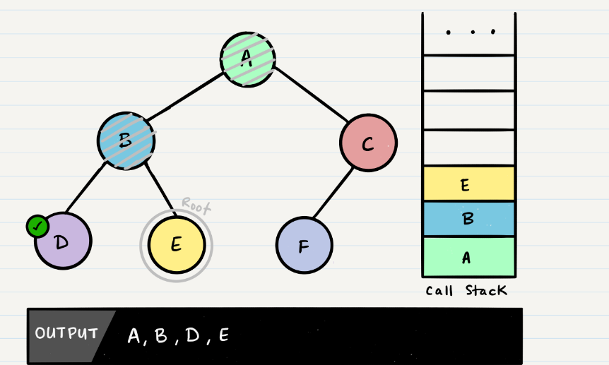

**Breadth First>>>>**
Breadth first traversal iterates through the tree by going through each level of the tree node-by-node. So, given our starting tree one more time:
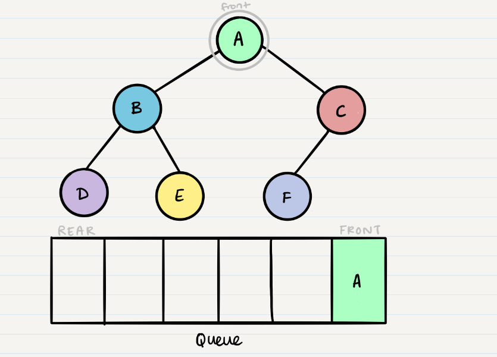

- Now that we have one node in our queue, we can dequeue it and use that node in our code.

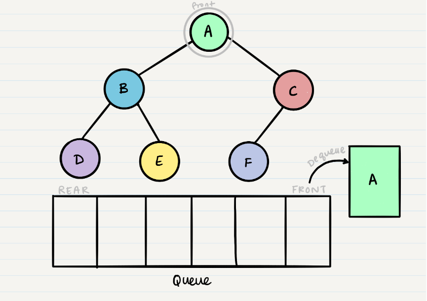

- From our dequeued node A, we can enqueue the left and right child (in that order).

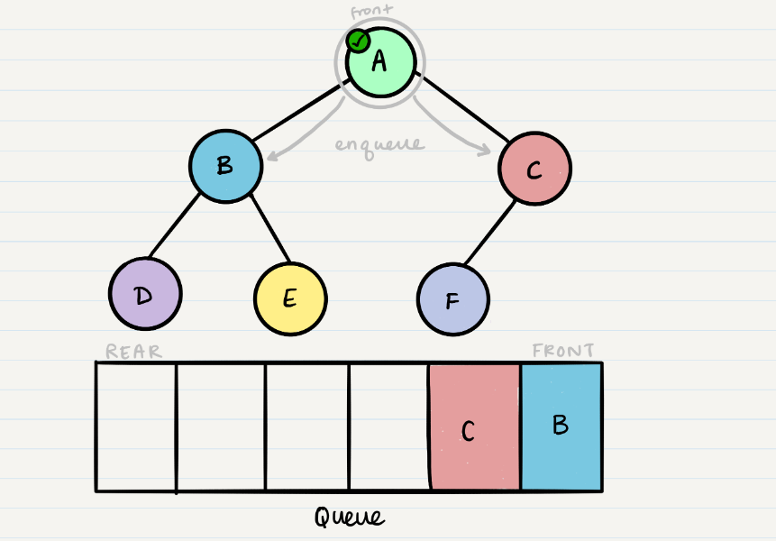

- This leaves us with B as the new front of our queue. We can then repeat the process we did with A: Dequeue the front node, enqueue that node’s left and right nodes, and move to the next new front of the queue.

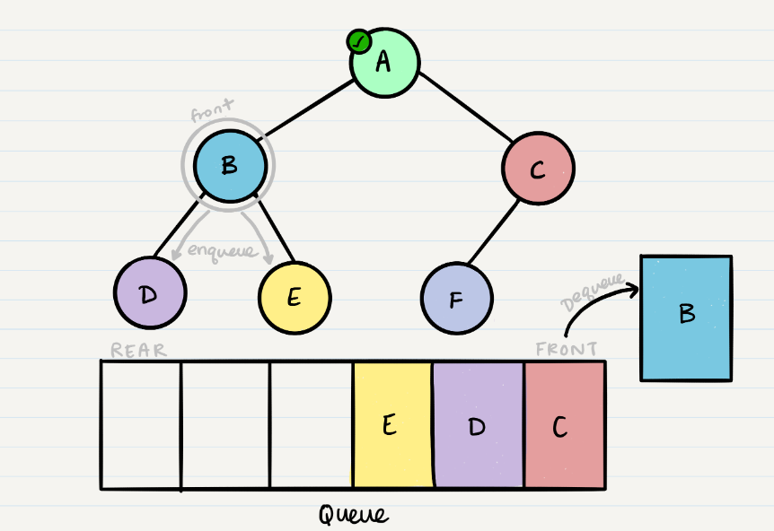

- And we continue onwards. When we reach a node that doesn’t have any children, we just dequeue it without any further enqueue.

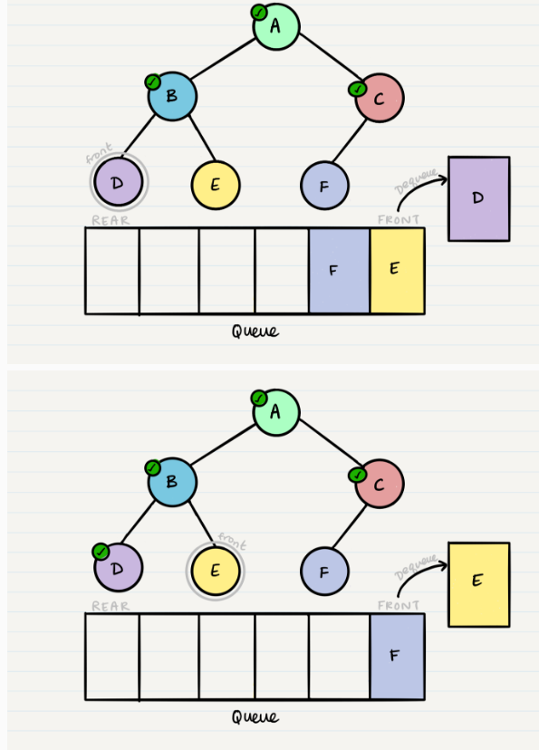
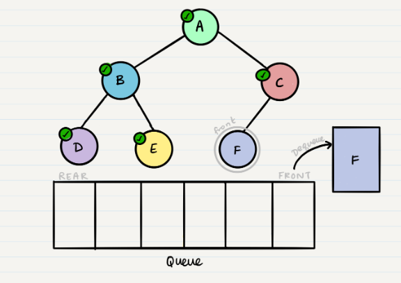

## Binary Tree Vs K-ary Trees 👀 📝
In all of our examples, we’ve been using a Binary Tree. Trees can have any number of children per node, but Binary Trees restrict the number of children to two (hence our left and right children).

There is no specific sorting order for a binary tree. Nodes can be added into a binary tree wherever space allows. Here is what a binary tree looks like:

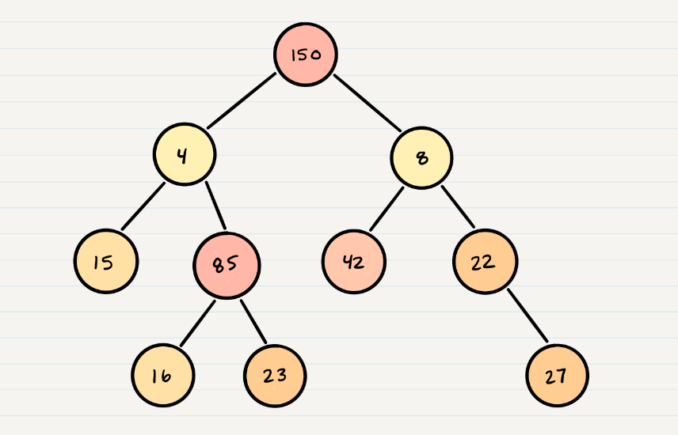

## K-ary Trees 👀 📝
If Nodes are able have more than 2 child nodes, we call the tree that contains them a K-ary Tree. In this type of tree we use K to refer to the maximum number of children that each Node is able to have.

## Breadth First Traversal
Traversing a K-ary tree requires a similar approach to the breadth first traversal. We are still pushing nodes into a queue, but we are now moving down a list of children of length k, instead of checking for the presence of a left and a right child.

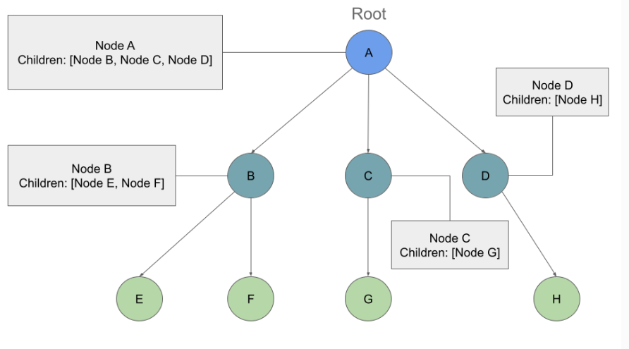

- If we traversed this tree Breadth First we should see the output:

Output: A, B, C, D, E, F, G, H

We will still start at the root Node, and we will add it to our queue:

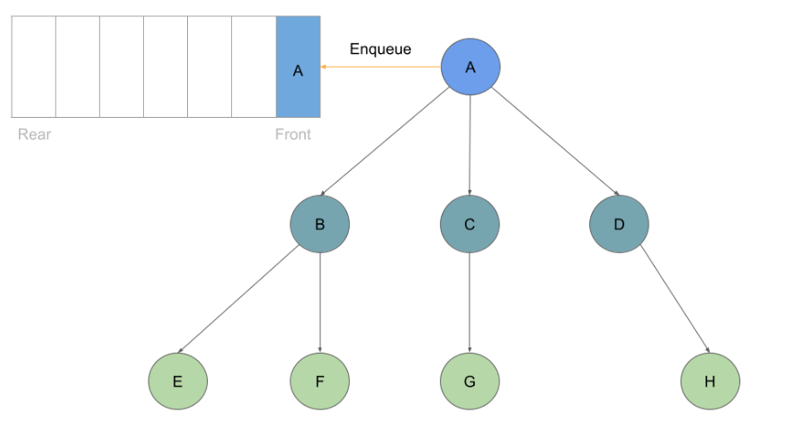

- Much like before, as long as we have a node in our queue we can dequeue:

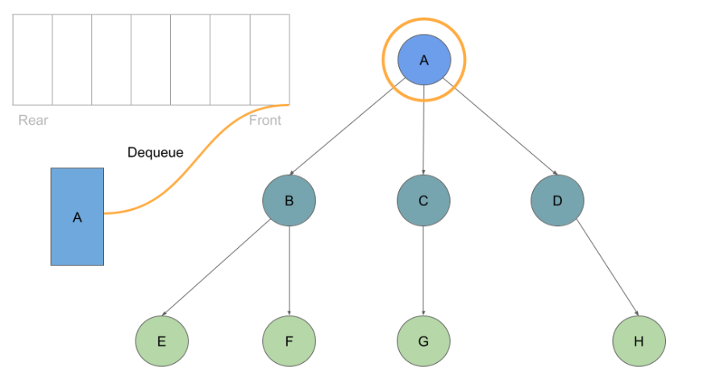

- With every Node we dequeue, we check its list of childre and enqueue each one:

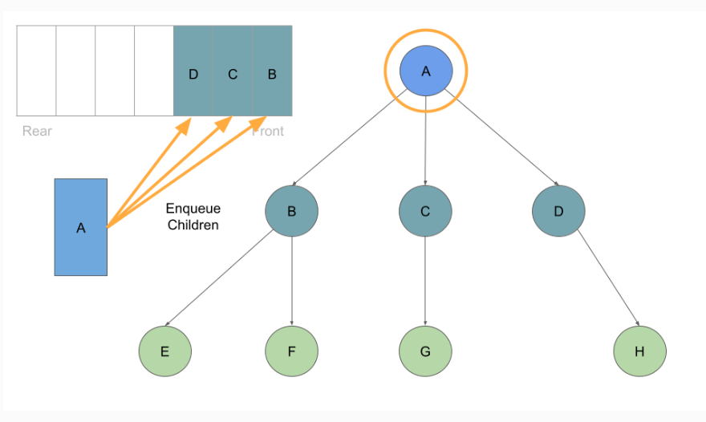

- Once these are queued up, can move on to Node B at the front of the queue, which we can dequeue followed by enqueing Node B’s children:

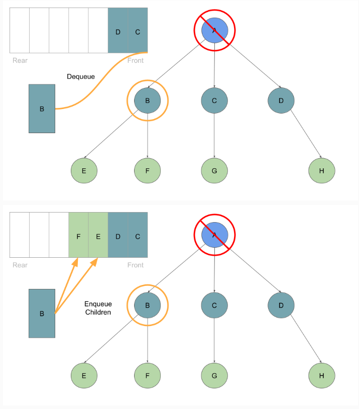

- This process of dequeuing and processing the Nodes at the front of the queue, followed by enqueing the current Node’s children continues until our queue is empty of child Nodes:

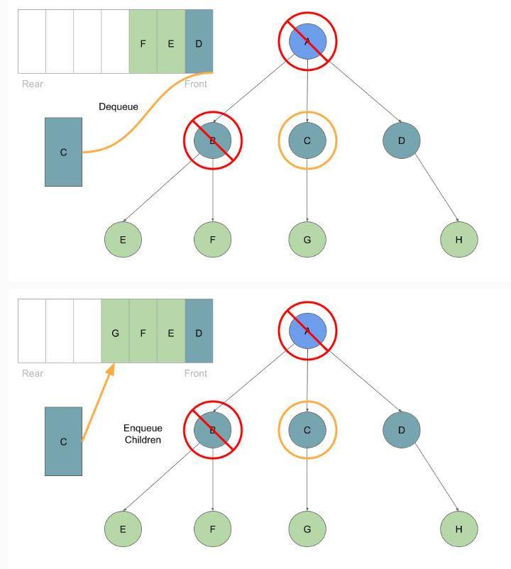
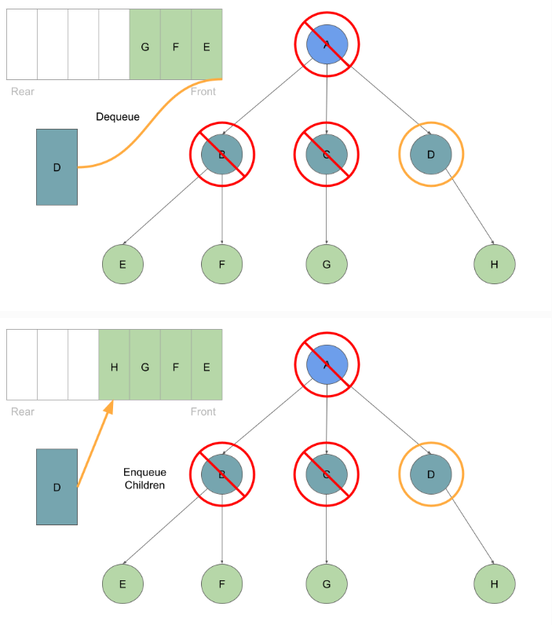
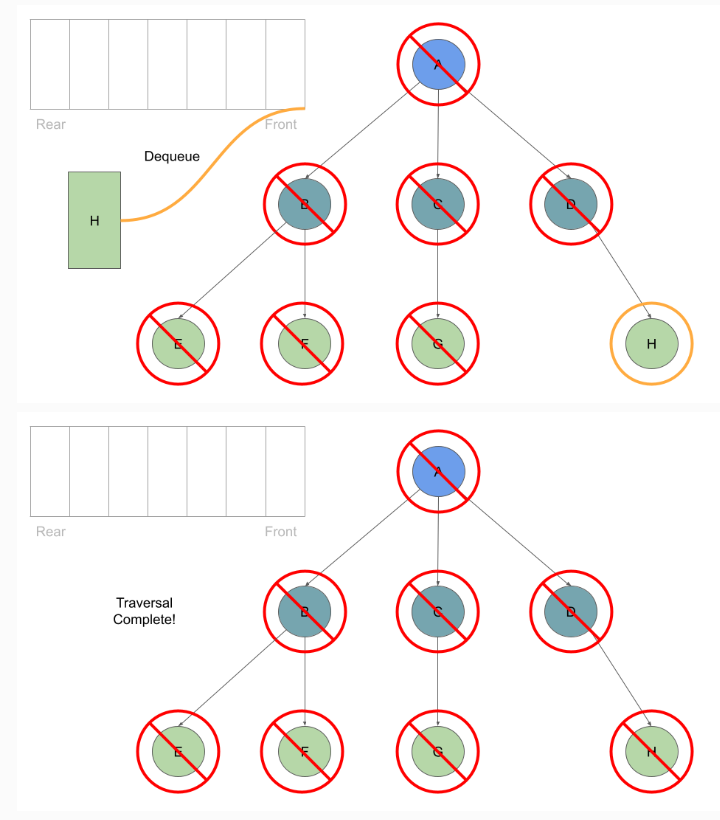

## Big O >> 👀 📝
The Big O time complexity for inserting a new node is O(n). Searching for a specific node will also be O(n). Because of the lack of organizational structure in a Binary Tree, the worst case for most operations will involve traversing the entire tree. If we assume that a tree has n nodes, then in the worst case we will have to look at n items, hence the O(n) complexity.

The Big O space complexity for a node insertion using breadth first insertion will be O(w), where w is the largest width of the tree. For example, in the above tree, w is 4.

A “perfect” binary tree is one where every non-leaf node has exactly two children. The maximum width for a perfect binary tree, is 2^(h-1), where h is the height of the tree. Height can be calculated as log n, where n is the number of nodes.

## Binary Search Trees 👀 📝
A Binary Search Tree (BST) is a type of tree that does have some structure attached to it. In a BST, nodes are organized in a manner where all values that are smaller than the root are placed to the left, and all values that are larger than the root are placed to the right.

Here is how we would change our Binary Tree example into a Binary Search Tree:

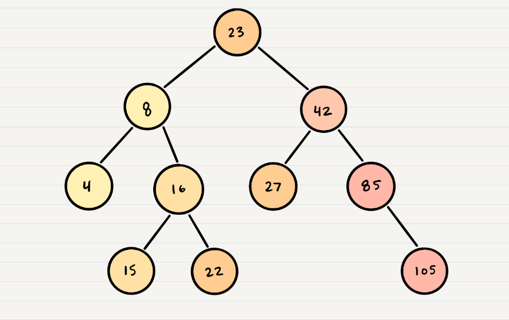

- Searching a BST
Searching a BST can be done quickly, because all you do is compare the node you are searching for against the root of the tree or sub-tree. If the value is smaller, you only traverse the left side. If the value is larger, you only traverse the right side.

Let’s say we are searching 15. We start by comparing the value 15 to the value of the root, 23.

15 < 23, so we traverse the left side of the tree. We then treat 8 as our new “root” to compare against.

15 > 8, so we traverse the right side. 16 is our new root.

15 < 16, so we traverse the left side. And aha! 15 is our new root and also a match with what we were searching for.

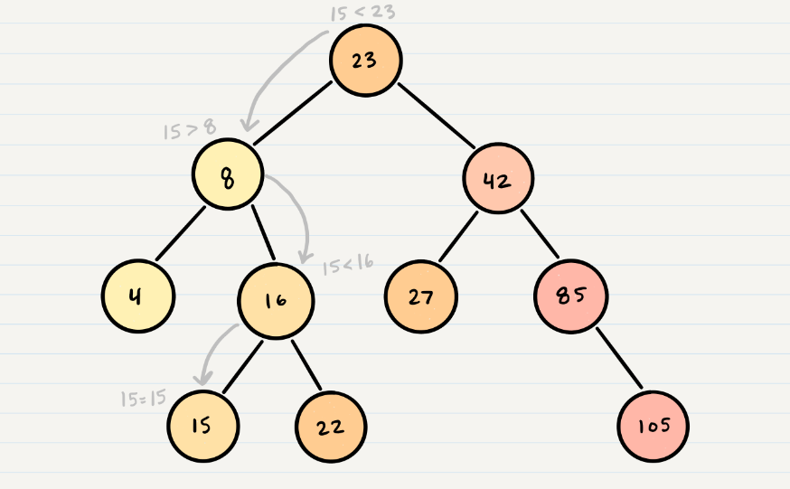

## Big O >> 👀 📝
The Big O time complexity of a Binary Search Tree’s insertion and search operations is O(h), or O(height). In the worst case, we will have to search all the way down to a leaf, which will require searching through as many nodes as the tree is tall. In a balanced (or “perfect”) tree, the height of the tree is log(n). In an unbalanced tree, the worst case height of the tree is n.

The Big O space complexity of a BST search would be O(1). During a search, we are not allocating any additional space.

[Back to the main page  ✔️](README.md)