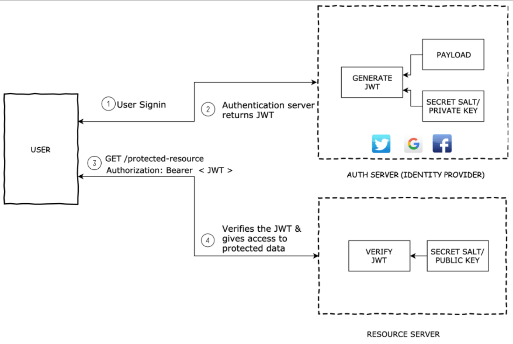

## JSON Web Token 👋 👩🏻‍💻 

- What is JSON Web Token?
- When should you use JSON Web Tokens?
- What is the JSON Web Token structure?
- How do JSON Web Tokens work?
- Why should we use JSON Web Tokens?

## What is JSON Web Token? 👀 📝
JSON Web Token (JWT) is an open standard (RFC 7519) that defines
 a compact and self-contained way for securely transmitting
  information between parties as a JSON object.
   

## When should you use JSON Web Tokens?👀 📝
* Authorization:
This is the most common scenario for using JWT. Once the user is logged in, each subsequent request will include the JWT, allowing the user to access routes, services, and resources that are permitted with that token. Single Sign On is a feature that widely uses JWT nowadays, because of its small overhead and its ability to be easily used across different domains.

* Information Exchange: 
JSON Web Tokens are a good way of securely transmitting information between parties. Because JWTs can be signed—for example, using public/private key pairs—you can be sure the senders are who they say they are. 

## What is the JSON Web Token structure? 👀 📝

 

## How do JSON Web Tokens work? 👀 📝
In authentication, when the user successfully logs in using their credentials, a JSON Web Token will be returned. Since tokens are credentials, great care must be taken to prevent security issues. In general, you should not keep tokens longer than required.

## Why should we use JSON Web Tokens? 👀 📝
WTs are a good way of securely transmitting information between parties because they can be signed, which means you can be sure that the senders are who they say they are. Additionally, the structure of a JWT allows you to verify that the content hasn't been tampered with
 

[Back to the main page  ✔️](README.md)

