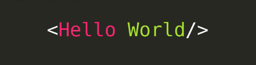

## Markdown:
1)(#) from one to six to the header font size 2. 
2) to put link   
3)to attatch image !()[]  
4)(- - -) for unorderd list 
5)** ** bold text
 

## Hello World
 

[GITHUB for me](https://github.com/engTasneemmaq)
 
 

- my
- fav
- course

**Tasneem Maqableh**  

