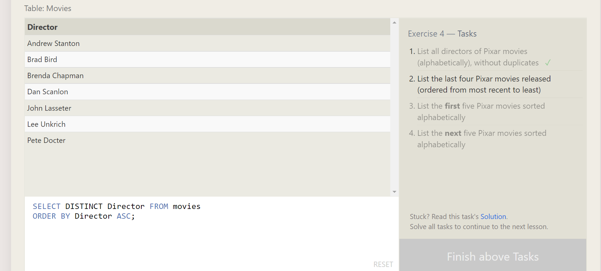

# 🌺 Advance Software Development 🌺  💻

# reading-notes 👀

***Auther: Tasneem Ali Maqableh***

*About:🔎 
SQL Practice:
This is to keep track of the observations and questions
from my reading assignments throughout the course.

**Summary:
1) select statment:statement that’s fetching data
for example: SELECT * FROM Movies;
the result give me all data of movies 
.
- we can odered the data by ASCending and DESCending Order Direction
-If want to LIMIT the number of results we use LIMIT
-You can use OFFSET 
specify from where to start returning data
- to add a condition we can use WHERE statment on SELECT 
for example:
SELECT * from Movies 
WHERE director ="%JOHN%"

- use Operator 

*** Screen shot: 🖼

[Back to the main page  ✔️](README.md)
