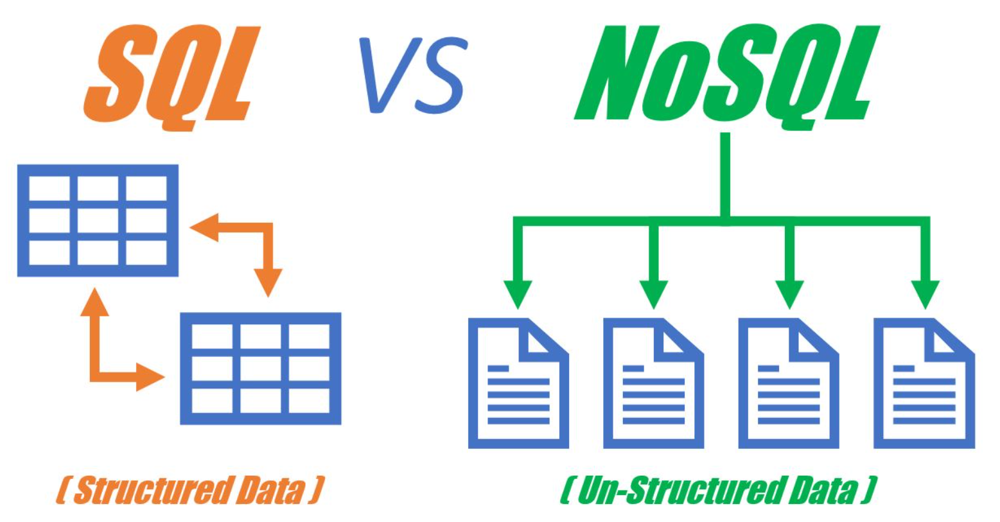
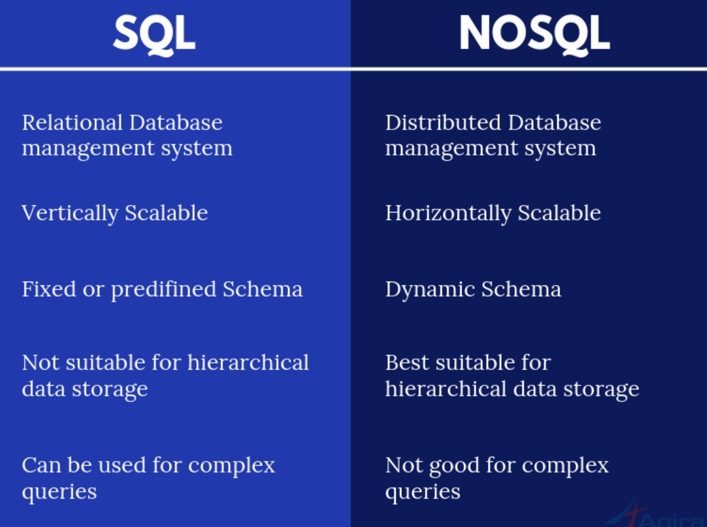
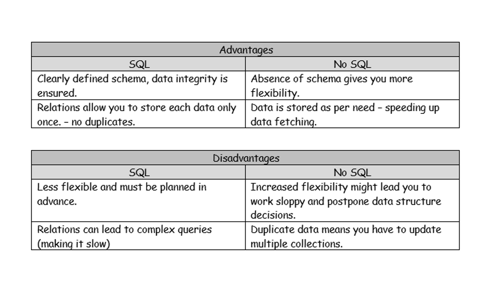
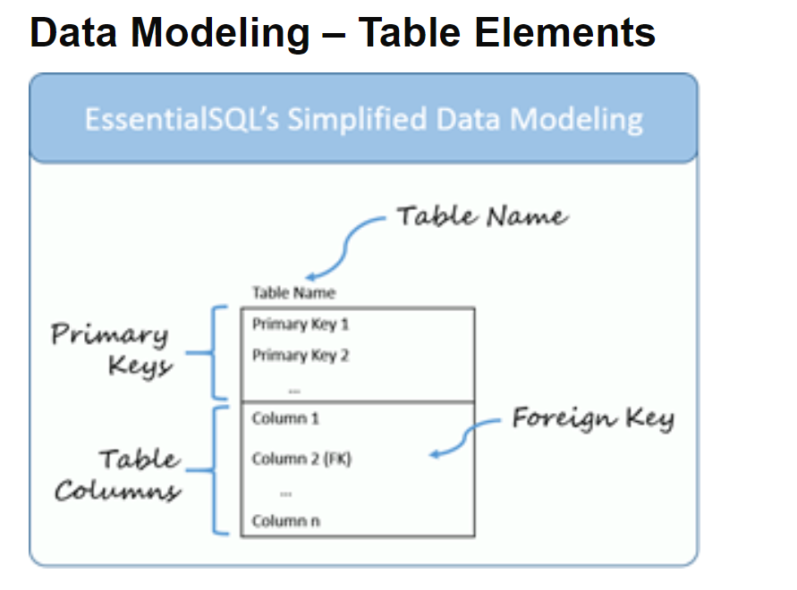
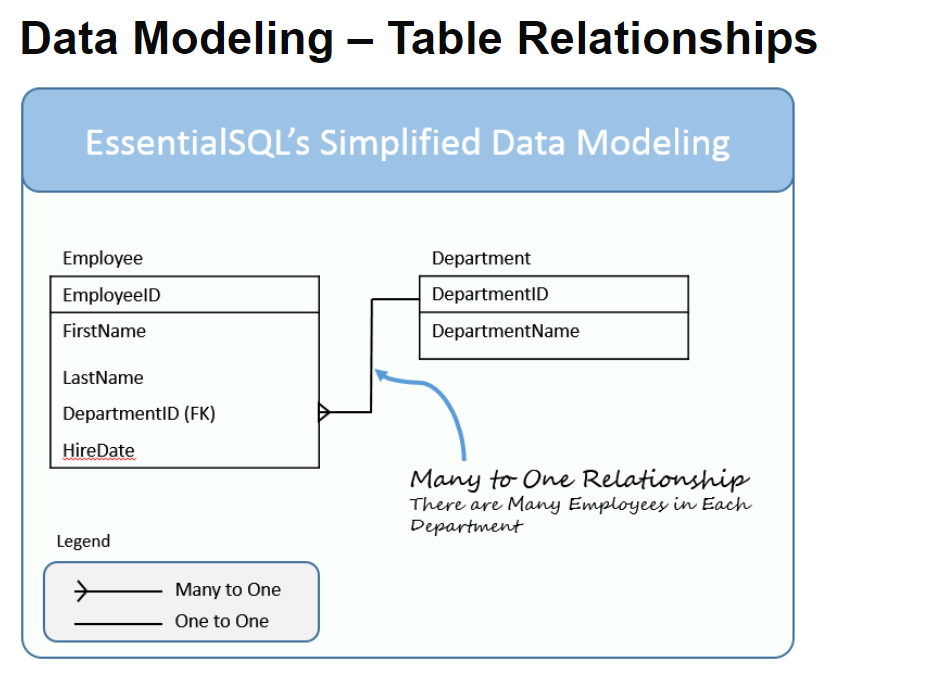

## SQL vs NoSQL 👋 👩🏻‍💻  
**SQL vs NoSQL Database Differences Explained with few Example DB**   

  

## 👀 📝  SQL vs NoSQL:The high level difference between SQL and NoSQL.
 

## First difference 1⃣
SQL databases are primarily called as Relational Databases (RDBMS).

NoSQL database are primarily called as non-relational or distributed database.

## Second difference 2⃣
SQL databases are table based databases.

NoSQL databases are document based, key-value pairs, graph databases or wide-column stores.

NoSQL databases do not have standard schema definitions.

## Third difference 3⃣
SQL databases have predefined schema.

NoSQL databases have dynamic schema for unstructured data.

## Fourth difference 4⃣
SQL databases are vertically scalable.

SQL databases are scaled by increasing the horse-power of the hardware.

NoSQL databases are horizontally scalable.

NoSQL databases are scaled by increasing the databases servers in the pool of resources to reduce the load.

## Fifth difference 5⃣
SQL databases uses SQL ( structured query language ) for defining and manipulating the data.

NoSQL database, queries are focused on collection of documents.

Also called as UnQL (Unstructured Query Language). The syntax of using UnQL varies from database to database.

## Sixth difference 6⃣
SQL database examples: MySql, Oracle, Sqlite, Postgres and MS-SQL.

NoSQL database examples: MongoDB, BigTable, Redis, RavenDb, Cassandra, Hbase, Neo4j and CouchDb.

---------------------------------------------
## SQL Database Examples:
1. MySQL Community Edition
MySQL database is very popular open-source database. It is generally been stacked with apache and PHP, although it can be also stacked with nginx and server side javascripting using Node js.

 

2. MS-SQL Server Express Edition
It is a powerful and user friendly database which has good stability, reliability and scalability with support from Microsoft.

3. Oracle Express Edition
It is a limited edition of Oracle Enterprise Edition server with certain limitations. This database is free for development and deployment.

## NoSQL Database Examples: 
1. MongoDB
Mongodb is one of the most popular document based NoSQL database as it stores data in JSON like documents. It is non-relational database with dynamic schema.

2. CouchDB
CouchDB is also a document based NoSQL database. It stores data in form of JSON documents.

3. Redis
Redis is another Open Source NoSQL database which is mainly used because of its lightening speed. It is written in ANSI C language. 

## Advantage & diadvantage between SQLvsNOSQL:👀 📝

## Data Modeling - Table Elements: 👀 📝🔎

## ## Data Modeling - Table Relationship: 👀 📝🔎

 
[Back to the main page  ✔️](README.md)