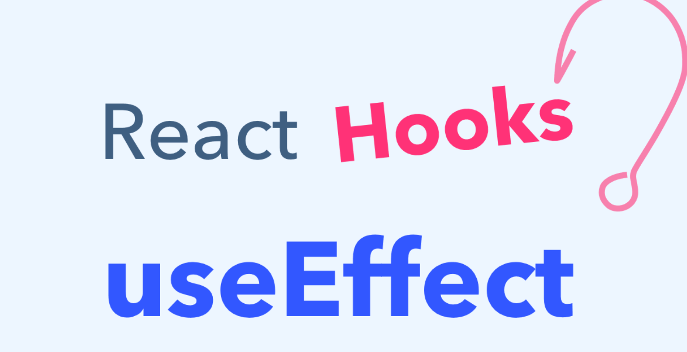
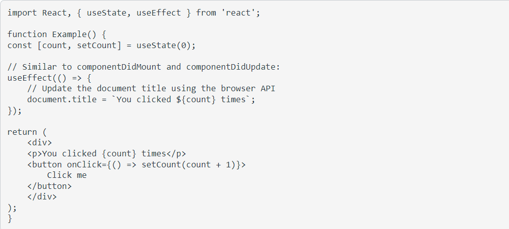
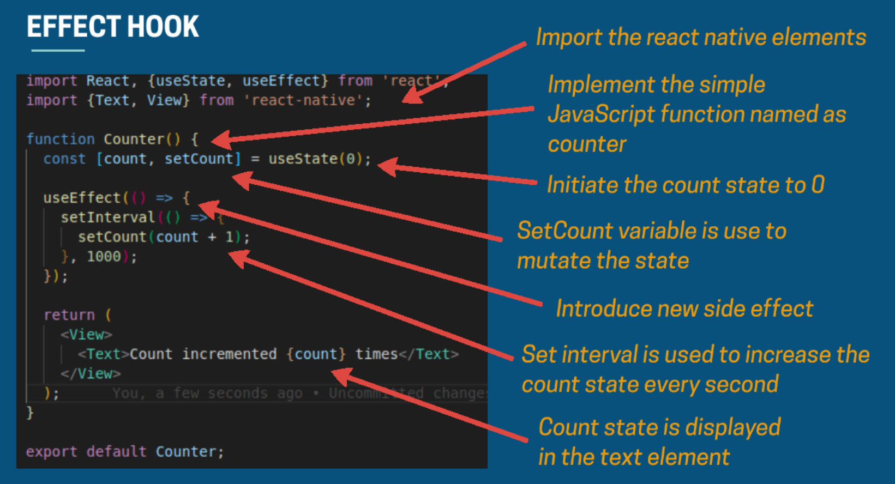

## Component Lifecycle / useEffect Hook 👋 👩🏻‍💻
 

## >> What purpose does useEffect serve in a function component compared to its counterpart(s) in class components? 👀 📝
The Effect Hook lets you perform side effects in function components:

>>The Effect Hook lets you perform side effects in function components:

- **This snippet is based on the counter example from the previous page, but we added a new feature to it: we set the document title to a custom message including the number of clicks.**

- **Data fetching, setting up a subscription, and manually changing the DOM in React components are all examples of side effects. Whether or not you’re used to calling these operations “side effects” (or just “effects”), you’ve likely performed them in your components before.**

## When using the useEffect Hook: 👀 📝

## 1. What does useEffect do?

>> By using this Hook, you tell React that your component needs to do something after render. React will remember the function you passed (we’ll refer to it as our “effect”), and call it later after performing the DOM updates. In this effect, we set the document title, but we could also perform data fetching or call some other imperative API.

## 2. Why is useEffect called inside a component?

>> Placing useEffect inside the component lets us access the count state variable (or any props) right from the effect. We don’t need a special API to read it — it’s already in the function scope. Hooks embrace JavaScript closures and avoid introducing React-specific APIs where JavaScript already provides a solution.

## 3. Does useEffect run after every render?

>> Yes! By default, it runs both after the first render and after every update. (We will later talk about how to customize this.) Instead of thinking in terms of “mounting” and “updating”, you might find it easier to think that effects happen “after render”. React guarantees the DOM has been updated by the time it runs the effects.

## Explain the importance of properly implementing effects with Cleanup 👀 📝

>>Earlier, we looked at how to express side effects that don’t require any cleanup. However, some effects do. For example, we might want to set up a subscription to some external data source. In that case, it is important to clean up so that we don’t introduce a memory leak.

 

 

[Back to the main page  ✔️](README.md)