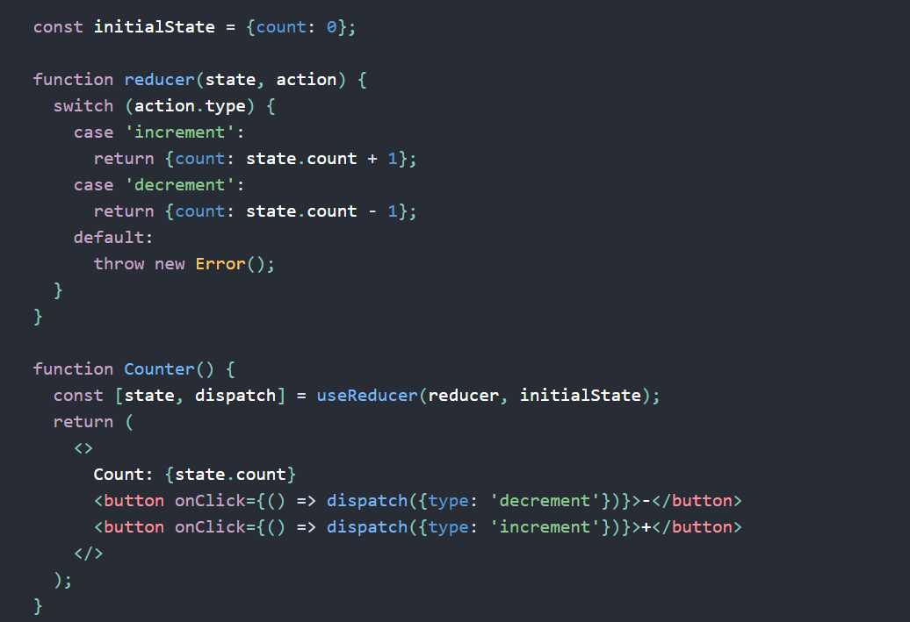
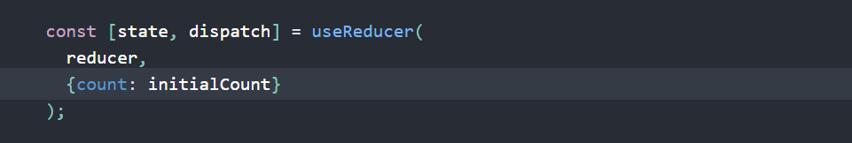
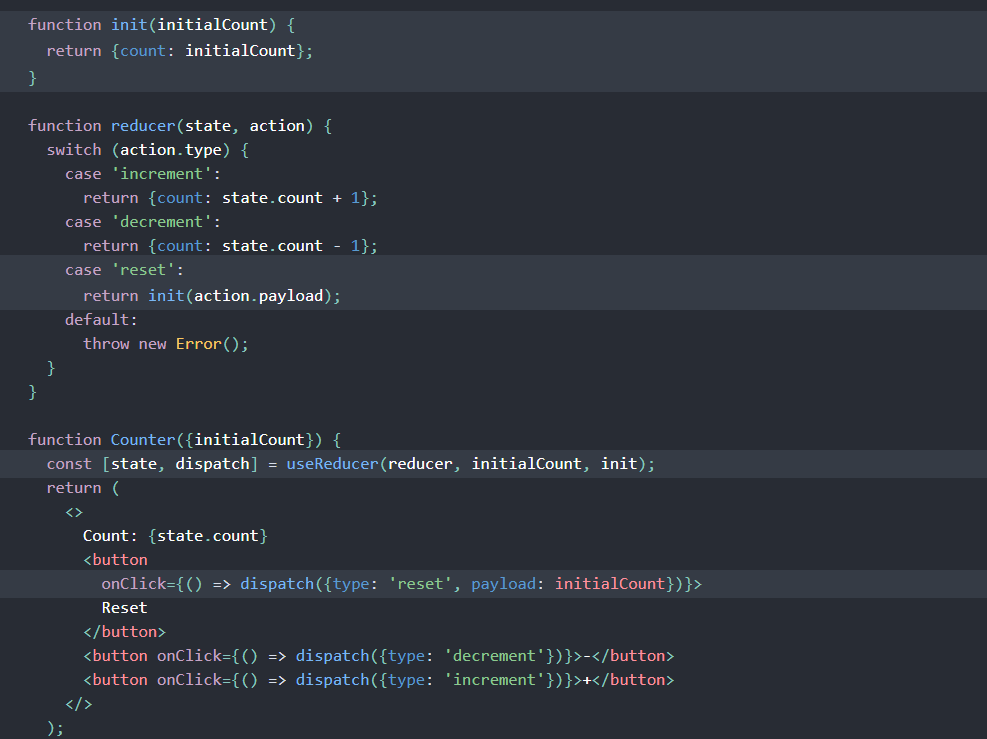
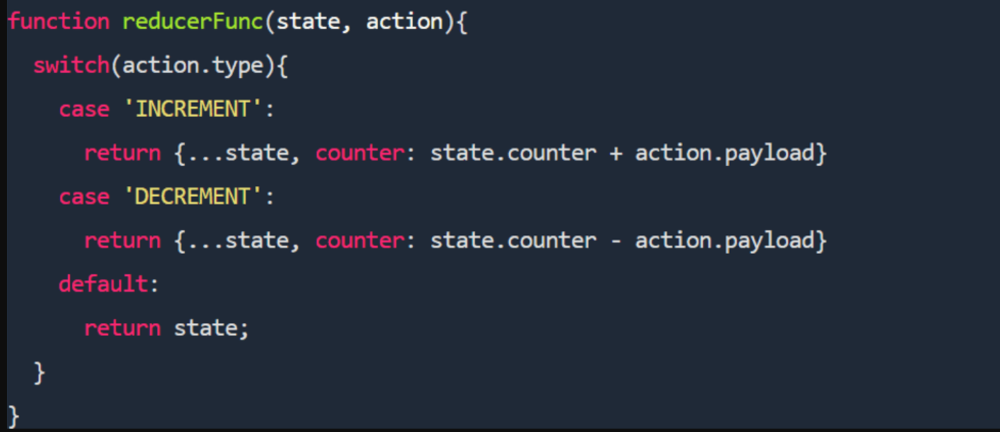
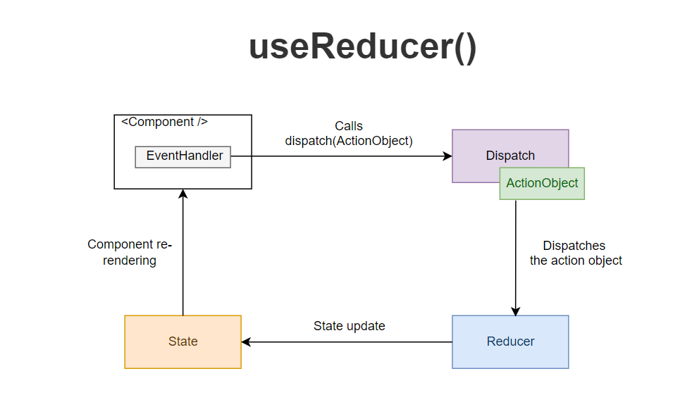

## Advanced State with Reducers 👋 👩🏻‍💻

## useReducer
***const [state, dispatch] = useReducer(reducer, initialArg, init);***

- An alternative to useState. Accepts a reducer of type (state, action) => newState, and returns the current state paired with a dispatch method. (If you’re familiar with Redux, you already know how this works.)

>> **useReducer is usually preferable to useState when you have complex state logic that involves multiple sub-values or when the next state depends on the previous one. useReducer also lets you optimize performance for components that trigger deep updates because you can pass dispatch down instead of callbacks.**

* Here’s the counter example from the useState section, rewritten to use a reducer:

## Specifying the initial state
>>There are two different ways to initialize useReducer state. You may choose either one depending on the use case. The simplest way is to pass the initial state as a second argument:

>>**Note**

**React doesn’t use the state = initialState argument convention popularized by Redux. The initial value sometimes needs to depend on props and so is specified from the Hook call instead. If you feel strongly about this, you can call useReducer(reducer, undefined, reducer) to emulate the Redux behavior, but it’s not encouraged.**

## Lazy initialization
- You can also create the initial state lazily. To do this, you can pass an init function as the third argument. The initial state will be set to init(initialArg).

- It lets you extract the logic for calculating the initial state outside the reducer. This is also handy for resetting the state later in response to an action:

## How does the useReducer Hook work?

## In terms of state, what does useReducer expect to receive as a parameter?
>>The useReducer Hook is used to store and update states, just like the useState Hook. It accepts a reducer function as its first parameter and the initial state as the second.

## What does useReducer return?
>>useReducer returns an array that holds the current state value and a dispatch function to which you can pass an action and later invoke it. While this is similar to the pattern Redux uses, there are a few differences.
 

## Explain dispatch to a non-technical recruiter.

>>The reducer function itself accepts two parameters and returns one value. The first parameter is the current state, and the second is the action. The state is the data we are manipulating. The reducer function receives an action, which is executed by a dispatch function:

**function reducer(state, action) { }
dispatch({ type: 'increment' })**

## References:
1. [useReducer hook](https://reactjs.org/docs/hooks-reference.html#usereducer)

2. [Ultimate Guide to useReducer](https://blog.logrocket.com/react-usereducer-hook-ultimate-guide/)

[Back to the main page  ✔️](README.md)